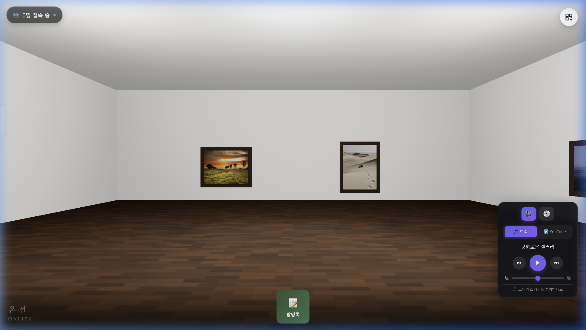
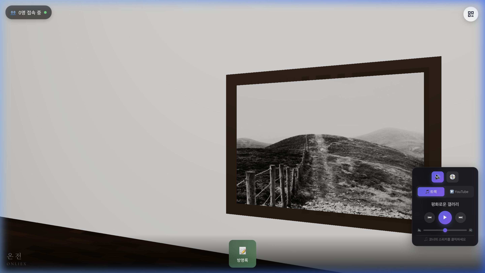
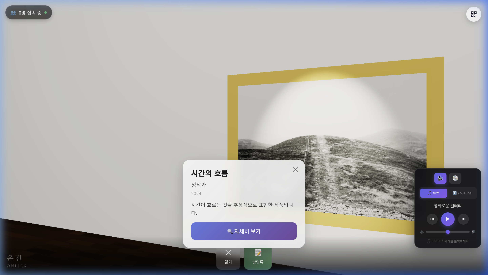
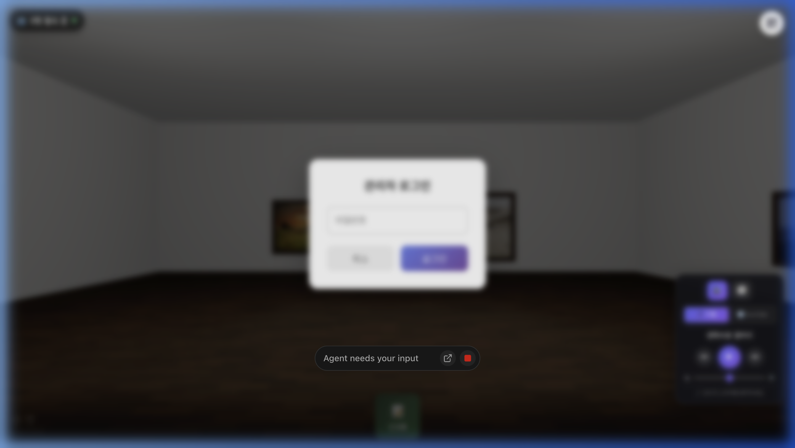
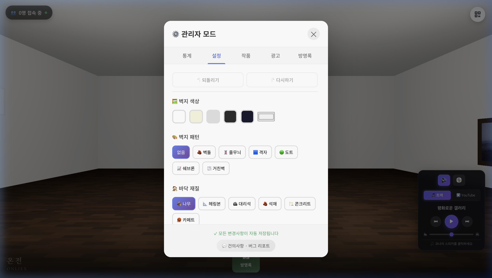
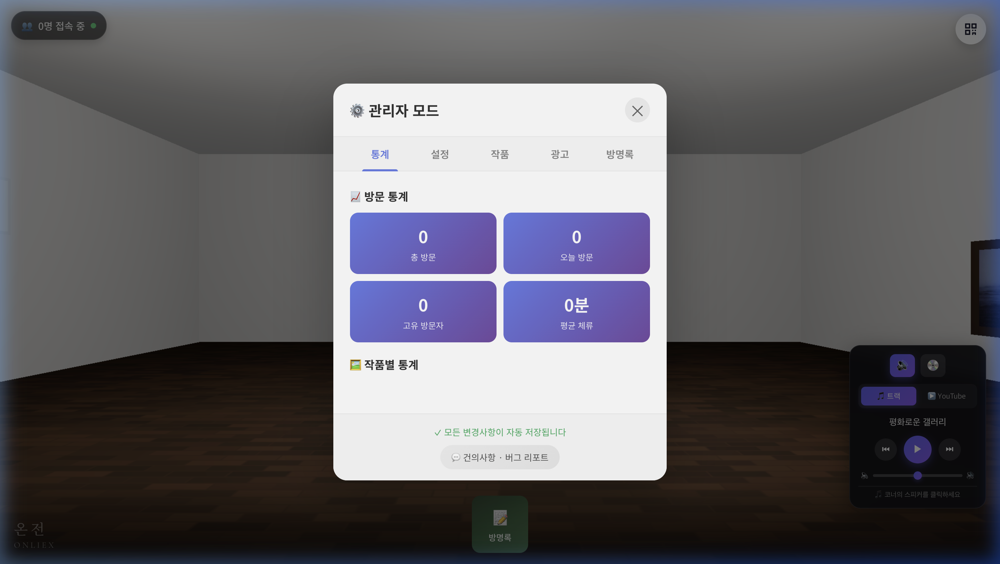
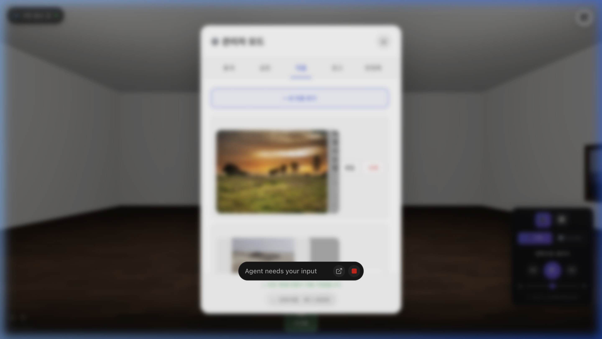
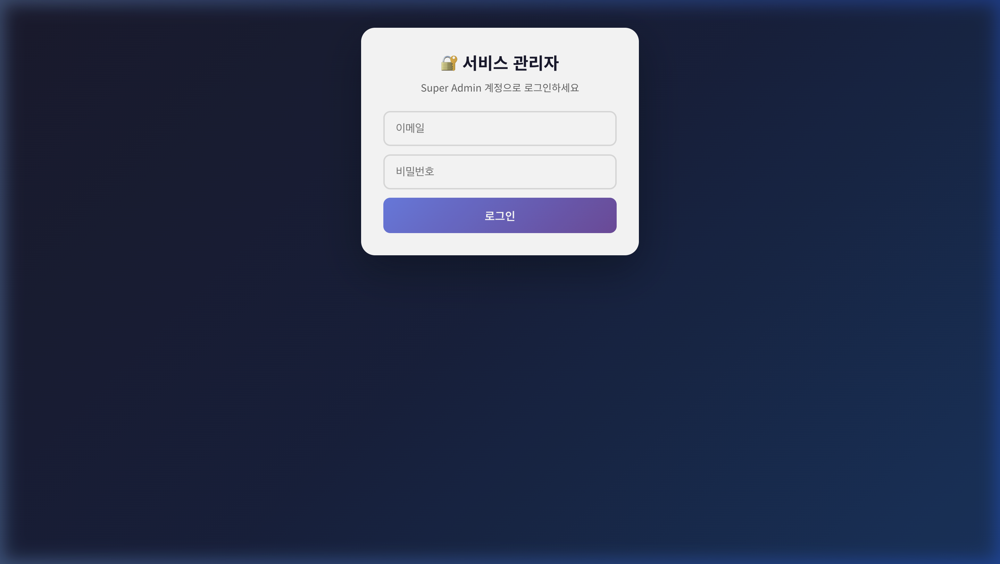
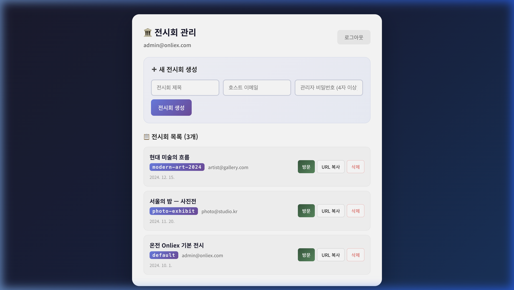
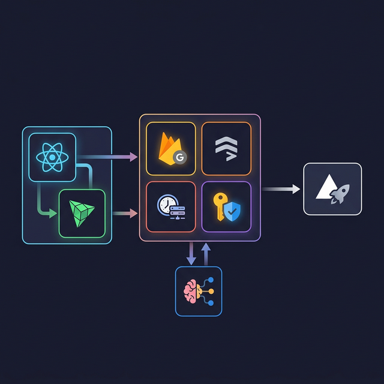

온전하게 전달되는 예술 — 몰입감 있는 3D 가상 전시회 플랫폼

<p align="center">
  
</p>

<h1 align="center">🎨 온전 Onliex</h1>

<p align="center">
  <strong>온전하게 전달되는 예술 — 몰입감 있는 3D 가상 전시회 플랫폼</strong>
</p>

<p align="center">
  <a href="https://3-dgallery.vercel.app"></a>
  <br/><br/>
  
  
  
  
  
  
  
</p>

---

## 📌 TL;DR

**온전 Onliex**는 누구나 코드 한 줄 없이 **3D 가상 갤러리**를 개설하고, 작품을 전시하며, 방문자들이 **리얼타임 멀티플레이어**로 함께 감상할 수 있는 웹 기반 온라인 전시회 플랫폼입니다.

전시 주최자의 의도를 **온전히** 전달하는 것이 핵심 가치이며, 브라우저만으로 접근 가능한 **Zero-install** 경험을 제공합니다.

> **"예술은 공간에서 경험되어야 한다"** — 물리적 제약을 넘어, 디지털 공간에서 전시의 본질을 재현합니다.

---

<p align="center">
  
  
</p>

<p align="center">
  <em>좌: 몰입형 3D 갤러리 공간 &nbsp;|&nbsp; 우: 작품 클릭 시 상세 정보 패널 (제목, 작가, 연도, 설명)</em>
</p>

---

## 📖 Table of Contents

- [프로젝트 배경 및 기획](#-프로젝트-배경-및-기획)
- [핵심 기능](#-핵심-기능)
- [비즈니스 모델](#-비즈니스-모델)
- [기술 아키텍처](#-기술-아키텍처)
- [기술적 챌린지 & 해결](#-기술적-챌린지--해결)
- [프로젝트 구조](#-프로젝트-구조)
- [시작하기](#-시작하기)
- [배운 점 & 회고](#-배운-점--회고)
- [로드맵](#-로드맵)
- [라이선스](#-라이선스)

---

## 🧠 프로젝트 배경 및 기획

### 왜 이 프로젝트를 시작했는가

15년차 개발자로서, 코로나 이후 폭발적으로 성장한 온라인 전시 시장을 지켜보며 몇 가지 핵심 문제를 발견했습니다:

| 기존 솔루션의 한계 | 온전 Onliex의 접근 |
|:---|:---|
| 🔴 단순 2D 이미지 슬라이드쇼 | 🟢 **몰입형 3D 공간**에서의 작품 감상 |
| 🔴 설치가 필요한 VR 앱 | 🟢 **브라우저 기반** Zero-install |
| 🔴 높은 개설 비용 ($500+/월) | 🟢 **무료~저비용** 셀프 개설 |
| 🔴 단독 감상 (소셜 요소 부재) | 🟢 **실시간 멀티플레이어** 동시 관람 |
| 🔴 개발자만 커스텀 가능 | 🟢 **노코드 Admin Panel**로 완벽 커스터마이징 |

### 기획 단계에서의 핵심 질문

1. **"어떻게 하면 물리적 갤러리의 '공간감'을 웹에서 재현할 수 있을까?"**
   - Three.js(React Three Fiber)를 선택한 이유: 선언적 3D 렌더링으로 빠른 이터레이션
   - WebGL 기반이므로 **모바일/데스크톱 크로스플랫폼** 가능

2. **"비기술자(작가/갤러리스트)가 5분 안에 전시를 열 수 있을까?"**
   - Setup Wizard 패턴 도입: 벽 색상 → 바닥 텍스처 → 조명 → 작품 업로드의 단계별 가이드
   - 초대 링크(Invite Token) 시스템으로 이메일만으로 관리자 인증

3. **"동시 접속 100명 이상을 서버 없이 지원할 수 있을까?"**
   - Serverless Architecture: Firebase Realtime DB의 `onDisconnect` 핸들러 활용
   - 비용 최적화를 위한 Heartbeat 주기 설계 (60초 간격)

---

## ✨ 핵심 기능

### 🏛️ 몰입형 3D 갤러리 공간

- **커스터마이징 가능한 전시 공간**: 벽 색상(5종), 벽 패턴(7종), 바닥 텍스처(6종) 조합으로 **210가지** 공간 디자인 가능
- **10가지 액자 스타일**: Classic, Modern, Minimal, Ornate, Slim, Bold, Shadow, Glass, Wood, Metal
- **실시간 조명 시스템**: 밝기, 강도, 색온도, 앰비언트 4축 조절 + 4가지 프리셋(주간/야간/갤러리/극적)
- **작품별 스포트라이트**: 선택된 작품에 자동으로 집중 조명 강화

### 👥 리얼타임 멀티플레이어

- **귀여운 미니 아바타**: 머리카락, 볼터치, 반짝이는 눈 등 디테일한 3D 캐릭터
- **실시간 위치 동기화**: Firebase Realtime DB를 활용한 저지연 위치 브로드캐스팅
- **자동 정리 시스템**: 비활성 3분 후 자동 제거, `onDisconnect` 핸들러로 비정상 종료 시 자동 정리
- **접속자 수 표시**: 실시간 동시 접속자 카운트

### 🎵 3D 뮤직 플레이어

- **LP 턴테이블 & 하이파이 스피커**: 두 가지 3D 디자인 선택 가능
- **YouTube 통합**: YouTube URL을 입력하면 갤러리 BGM으로 사용
- **로열티 프리 기본 트랙**: 4곡의 기본 앰비언트 음악 제공

### 📝 방명록 시스템

- **3D 벽면 방명록**: 게스트북 메시지가 갤러리 벽면에 실시간으로 3D 카드 형태로 표시
- **좋아요 & 인기순 정렬**: 좋아요 기능 + 5분 쿨다운으로 어뷰징 방지
- **비속어 필터링**: 자동 필터링 시스템

### 🎨 Close-Up 뷰 & 작품 감상

- **클릭/더블탭으로 작품 확대**: 원본 해상도로 작품 감상
- **작품 정보 패널**: 제목, 작가, 연도, 설명 표시
- **감상 시간 추적**: 작품별 클릭 수, 총 감상 시간 등 Analytics 자동 수집

### 🛠️ 노코드 관리자 패널

- **Setup Wizard**: 첫 전시 개설 시 단계별 가이드
- **실시간 미리보기**: 설정 변경 시 갤러리에 즉시 반영
- **Undo/Redo 지원**: 설정 변경 히스토리 관리
- **초대 링크 시스템**: 1회용 토큰 기반 보안 초대
- **Super Admin**: 전체 전시 관리, 신규 전시 생성/삭제

<p align="center">
  
  
</p>
<p align="center">
  <em>좌: 관리자 로그인 (비밀번호 기반 인증) &nbsp;|&nbsp; 우: 설정 탭 - 벽지 색상, 패턴, 바닥 재질 커스터마이징</em>
</p>

<p align="center">
  
  
</p>
<p align="center">
  <em>좌: 통계 탭 - 방문자 수, 고유 방문자, 평균 체류 시간 대시보드 &nbsp;|&nbsp; 우: 작품 관리 - 작품 추가/편집/삭제</em>
</p>

> 관리자 패널은 5개의 탭(통계 · 설정 · 작품 · 광고 · 방명록)으로 구성되어 있으며,
> 모든 변경사항은 갤러리에 **실시간으로 반영**됩니다.

### 🏛️ 슈퍼 관리자 (서비스 관리자)

전시회를 **신규 생성하고 관리**할 수 있는 최상위 관리자 페이지입니다. Firebase Authentication 기반의 이메일 인증으로 보안이 적용되며, 인증된 Super Admin만 접근 가능합니다.

- **전시회 생성**: 전시 제목, 호스트 이메일, 관리자 비밀번호를 입력하면 고유 전시 코드가 자동 생성
- **초대 링크 발급**: 생성 시 7일간 유효한 1회용 초대 토큰이 자동 발급되어, 호스트에게 전달하면 바로 관리자 권한 부여 + Setup Wizard 시작
- **전시회 목록 관리**: 모든 전시회를 한눈에 확인, 방문/URL 복사/삭제 가능
- **멀티 테넌시**: 전시별 독립 데이터 격리로 여러 전시를 동시 운영

<p align="center">
  
  
</p>
<p align="center">
  <em>좌: Super Admin 로그인 (Firebase Auth 이메일 인증) &nbsp;|&nbsp; 우: 전시회 관리 대시보드 — 생성, 목록 조회, 삭제</em>
</p>

### 📱 모바일 최적화

- **터치 제스처**: 1손가락 드래그(시점 회전), 2손가락 드래그(이동), 핀치(줌)
- **WASD + 방향키**: 데스크톱 키보드 컨트롤
- **반응형 UI**: 모바일/데스크톱 adaptive layout
- **QR 코드 공유**: 전시 페이지 QR 코드 생성+공유

---

## 💰 비즈니스 모델

### Revenue Streams 설계

프로젝트 기획 시 다음과 같은 수익 모델을 고려하여 아키텍처를 설계했습니다:

```
┌─────────────────────────────────────────────────────┐
│                  Freemium Model                     │
├─────────────────────────────────────────────────────┤
│                                                     │
│  🆓 Free Tier                                      │
│  ├── 작품 5점까지 전시                              │
│  ├── 기본 갤러리 테마                               │
│  ├── 브랜드 워터마크 표시                           │
│  └── 기본 BGM 제공                                  │
│                                                     │
│  💎 Pro Tier ($9.99/월)                             │
│  ├── 무제한 작품                                    │
│  ├── 모든 커스텀 옵션                               │
│  ├── 워터마크 제거                                  │
│  ├── YouTube BGM 연결                               │
│  ├── 방문자 Analytics                               │
│  └── 커스텀 도메인 연결                             │
│                                                     │
│  🏢 Enterprise                                      │
│  ├── 다중 전시 관리                                 │
│  ├── API 연동                                       │
│  ├── White-label                                    │
│  └── 전용 지원                                      │
│                                                     │
│  📢 Ad Slots (부가 수익)                            │
│  ├── 갤러리 벽면 광고 슬롯                          │
│  └── CPC/CPM 기반 과금                              │
│                                                     │
└─────────────────────────────────────────────────────┘
```

### 아키텍처에 반영된 비즈니스 로직

| 기능 | 비즈니스 의도 | 기술적 구현 |
|:---|:---|:---|
| `AdSlots` 컴포넌트 | 벽면 광고 수익화 | Wall A/B/C/D별 광고 배치, 클릭 시 외부 링크 이동 |
| `BrandWatermark` | 프리미엄 전환 유도 | Free tier에서 우측 하단 브랜드 노출 |
| `ArtworkAnalytics` | 데이터 기반 가치 증명 | 작품별 클릭수, 감상시간 자동 트래킹 |
| `VisitorStats` | 전시 성과 리포트 | 총 방문, 유니크 방문자, 평균 체류시간 |
| `ExhibitionMeta` | 멀티 테넌시 | 전시별 독립 데이터 격리 |
| 초대 토큰 시스템 | 유료 전시 보안 | 1회용 토큰 + 만료 시간 관리 |

---

## 🏗️ 기술 아키텍처

<p align="center">
  
</p>

### 전체 아키텍처

```
┌─────────────── Client (Browser) ─────────────────┐
│                                                   │
│  ┌──────────┐  ┌────────────┐  ┌──────────────┐  │
│  │ React 19 │──│ R3F / Drei │──│  Three.js    │  │
│  │ Router   │  │  Canvas    │  │  r182        │  │
│  └────┬─────┘  └────────────┘  └──────────────┘  │
│       │                                           │
│  ┌────┴──────────────────────────────────────┐    │
│  │           Zustand Store Layer             │    │
│  │  ┌─────────────┐  ┌────────────────────┐  │    │
│  │  │ galleryStore │  │ multiplayerStore   │  │    │
│  │  │ (persist)    │  │ (ephemeral)        │  │    │
│  │  └──────┬──────┘  └────────┬───────────┘  │    │
│  └─────────┼──────────────────┼──────────────┘    │
│            │                  │                    │
│  ┌─────────┴──────┐  ┌───────┴────────────┐      │
│  │ useFirebaseSync │  │ useMultiplayerSync │      │
│  │ (Firestore)     │  │ (Realtime DB)      │      │
│  └────────┬────────┘  └───────┬────────────┘      │
└───────────┼───────────────────┼───────────────────┘
            │                   │
┌───────────┴───────────────────┴───────────────────┐
│               Firebase Backend                     │
│  ┌──────────────┐  ┌──────────────┐  ┌─────────┐  │
│  │  Firestore   │  │ Realtime DB  │  │  Auth   │  │
│  │  (영속 데이터) │  │ (실시간 위치) │  │ (인증)  │  │
│  └──────────────┘  └──────────────┘  └─────────┘  │
└───────────────────────────────────────────────────┘
            │
┌───────────┴───────────────────────────────────────┐
│               Vercel (Hosting + CDN)               │
│     SPA Rewrite Rules + Edge Network               │
└───────────────────────────────────────────────────┘
```

### 핵심 기술 선택의 이유

| 기술 | 선택 이유 | 대안 대비 장점 |
|:---|:---|:---|
| **React Three Fiber** | 선언적 3D = React 생태계와 자연스러운 통합 | 순수 Three.js 대비 컴포넌트 재사용성 극대화 |
| **Zustand** (persist) | 설정 데이터 로컬 캐싱 + 심플한 API | Redux 대비 보일러플레이트 90% 감소 |
| **Firestore** (영속 데이터) | 작품/설정/방명록 등 영속 데이터 | Supabase 대비 onSnapshot 실시간 리스너 우위 |
| **Realtime DB** (위치 데이터) | 멀티플레이어 위치 동기화 | Firestore보다 **bandwidth 기반 과금**으로 비용 최적화 |
| **Firebase Auth** | Super Admin 이메일 인증 | 자체 인증 대비 보안 + 유지보수 비용 절감 |
| **Vite 7** | 빌드 속도 + HMR 성능 | CRA 대비 10배 이상 빠른 빌드 |
| **Vercel** | SPA 호스팅 + CDN + 간편 배포 | Netlify 대비 Edge Function 확장성 |

### Firebase Dual Database 전략

이 프로젝트에서 가장 핵심적인 아키텍처 결정은 **Firestore와 Realtime DB의 이원화**입니다:

```
                 데이터 특성에 따른 DB 분리

  ┌───────────────────────┐    ┌───────────────────────┐
  │     Firestore         │    │   Realtime Database   │
  │                       │    │                       │
  │  📌 영속 데이터         │    │  ⚡ 초단위 갱신 데이터   │
  │  ├── 전시 메타정보      │    │  ├── 플레이어 위치      │
  │  ├── 작품 목록          │    │  ├── 플레이어 회전      │
  │  ├── 갤러리 설정        │    │  └── 마지막 활동 시간   │
  │  ├── 방명록             │    │                       │
  │  └── 광고 슬롯          │    │  💰 과금: bandwidth     │
  │                       │    │     (읽기/쓰기 무관)    │
  │  💰 과금: 읽기/쓰기 횟수 │    │                       │
  └───────────────────────┘    └───────────────────────┘

  → 멀티플레이어 위치를 Firestore에 넣었다면?
    100명 × 초당 1회 × 3600초 = 360,000 읽기/시간 💸
    
  → Realtime DB에서는?
    bandwidth 기반이므로 100명 동시접속도 수 KB/s 💰
```

---

## 🔧 기술적 챌린지 & 해결

### 1. WebGL Context Loss 문제

**문제**: 모바일 디바이스에서 메모리 부족 시 WebGL 컨텍스트가 손실되어 검은 화면 발생

**해결**:

```typescript
// 4단계 방어 전략
// 1. GPU 부담 최소화
gl={{
  powerPreference: 'low-power',    // 저전력 GPU 선호
  stencil: false,                   // 불필요한 버퍼 제거
  preserveDrawingBuffer: true,      // 컨텍스트 복구 지원
}}
dpr={Math.min(window.devicePixelRatio, 1.5)}  // DPR 상한 제한

// 2. 디바운스된 컨텍스트 손실 핸들링
// 3. 자동 재시도 (최대 2회, 1.5초 간격)
// 4. Canvas Key 교체를 통한 완전 재생성
```

### 2. 초기화 순서 (Phase-based Initialization)

**문제**: Firebase 연결, Multiplayer 연결, WebGL Canvas를 동시에 초기화하면 Race Condition 및 메모리 스파이크 발생

**해결**: 4단계 지연 initial화 패턴 설계

```
Phase 1 (즉시)   → Exhibition Code 설정
Phase 2 (+200ms) → Firebase Sync 시작
Phase 3 (+600ms) → Multiplayer Sync 시작
Phase 4 (+1400ms)→ Canvas/WebGL 렌더링 시작
```

각 단계가 이전 단계의 완료를 보장하는 **워터풀 패턴**으로, React StrictMode의 double-mount까지 고려한 안정적 초기화를 구현했습니다.

### 3. 멀티플레이어 비용 최적화

**문제**: 실시간 위치 동기화 시 Firebase 비용이 기하급수적으로 증가

**해결**:

| 최적화 기법 | 적용 방식 | 비용 절감 효과 |
|:---|:---|:---|
| Heartbeat 주기 확대 | 60초 간격으로 필수 갱신만 | 기존 대비 60배 쓰기 감소 |
| Firestore → RTDB 전환 | 위치 데이터를 RTDB로 분리 | 읽기 과금 → bandwidth 과금 |
| 비활성 플레이어 자동 제거 | 3분 미활동 시 자동 삭제 | 불필요한 구독 데이터 제거 |
| `onDisconnect` 핸들러 | 브라우저 강제 종료 시 자동 정리 | Zombie 플레이어 방지 |
| Memory Cache 시스템 | 전시 메타/설정 캐싱 (TTL별) | Firestore 읽기 최소화 |

### 4. 3D 렌더링 성능 최적화

```typescript
// 1. React.memo로 작품 컴포넌트 리렌더링 방지
const ArtworkItem = memo(function ArtworkItem({ artwork }: ArtworkProps) { ... });

// 2. useMemo로 계산 비용이 큰 값 캐싱
const imageSize = useMemo(() => { /* 텍스처 비율 계산 */ }, [texture]);
const position = useMemo(() => { /* 벽면별 위치 계산 */ }, [artwork.wall, ...]);

// 3. 텍스처 사이즈 제한 (256px)
const TEXTURE_SIZE = 256;

// 4. Canvas DPR 제한 (최대 1.5)
dpr={Math.min(window.devicePixelRatio, 1.5)}

// 5. Selective Zustand 구독
const guestMessages = useGalleryStore((state) => state.guestMessages);
```

### 5. Sync Loop 방지 (Firebase ↔ Store)

**문제**: Store 변경 → Firebase 저장 → Firebase 리스너 → Store 변경 → ♻️ 무한 루프

**해결**: Global flag를 활용한 방향성 동기화

```typescript
let isReceivingFromFirebase = false;

// Firebase → Store (수신 시)
isReceivingFromFirebase = true;
store.setArtworks(data);
isReceivingFromFirebase = false;

// Store → Firebase (발신 시)
if (isReceivingFromFirebase) return; // 수신 중이면 무시
saveToFirebase(data);
```

---

## 📁 프로젝트 구조

```
src/
├── App.tsx                          # 라우팅 + 전시 페이지 (Phase 초기화)
├── App.css                          # 글로벌 스타일 + 브랜드 컨테이너
├── main.tsx                         # React 앱 진입점
│
├── components/
│   ├── Scene.tsx                     # R3F 씬 구성 (카메라, 조명, 오브젝트)
│   ├── GalleryRoom.tsx               # 3D 갤러리 룸 (벽, 바닥, 천장, 조명)
│   ├── Artwork.tsx                   # 작품 렌더링 (10종 프레임, 스포트라이트)
│   ├── MusicPlayer3D.tsx             # 3D 스피커/LP + YouTube 통합
│   ├── OtherPlayers.tsx              # 멀티플레이어 아바타 렌더링
│   ├── GuestbookWall.tsx             # 3D 방명록 벽면 카드
│   ├── CloseUpCamera.tsx             # 작품 확대 카메라 제어
│   ├── AdSlots.tsx                   # 벽면 광고 슬롯
│   │
│   ├── admin/
│   │   ├── AdminAuth.tsx             # 관리자 인증 (비밀번호 기반)
│   │   ├── AdminPanel.tsx            # 전시 관리 패널 (40KB 풀 패널)
│   │   ├── SetupWizard.tsx           # 첫 전시 설정 위저드
│   │   └── SuperAdminPanel.tsx       # 최상위 관리자 패널
│   │
│   └── ui/
│       ├── ArtworkInfoPanel.tsx      # 작품 정보 오버레이
│       ├── BottomNavigation.tsx       # 하단 네비게이션 바
│       ├── BrandWatermark.tsx         # 브랜드 로고 워터마크
│       ├── CloseUpView.tsx            # 작품 확대 뷰 + 감상시간 추적
│       ├── GuestbookForm.tsx          # 방명록 작성 폼 (비속어 필터)
│       ├── MusicPlayer.tsx            # 2D 뮤직 플레이어 UI
│       ├── PlayerCount.tsx            # 실시간 접속자 수
│       ├── QRCodeShare.tsx            # QR 코드 공유 모달
│       └── TouchGuide.tsx             # 터치/키보드 가이드 오버레이
│
├── hooks/
│   ├── useFirebaseSync.ts            # Firestore ↔ Store 양방향 동기화
│   ├── useMultiplayerSync.ts         # RTDB ↔ 멀티플레이어 동기화
│   ├── usePlayerPositionSync.ts      # 플레이어 위치 업데이트 훅
│   ├── usePositionUpdater.ts         # 카메라 → 플레이어 위치 변환
│   ├── useTouchControls.ts           # 모바일 터치 제스처 처리
│   └── useDeviceDetect.ts            # 디바이스 타입 감지
│
├── store/
│   ├── galleryStore.ts               # 메인 상태 관리 (Zustand + persist)
│   └── multiplayerStore.ts           # 멀티플레이어 상태 (ephemeral)
│
├── lib/
│   ├── firebase.ts                   # Firebase 초기화 + Firestore CRUD + 캐시
│   └── realtimeDb.ts                 # Realtime DB 초기화 + 멀티플레이어 CRUD
│
└── constants/
    └── galleryOptions.ts             # 벽 색상/패턴, 바닥, 프레임, 조명 프리셋
```

---

## 🚀 시작하기

### Prerequisites

- **Node.js** 18+
- **Firebase 프로젝트** (Firestore + Realtime Database + Authentication 활성화)

### 설치

```bash
# 1. 클론
git clone https://github.com/yourusername/3Dgallery.git
cd 3Dgallery

# 2. 의존성 설치
npm install

# 3. 환경 변수 설정
cp .env.example .env
# .env 파일에 Firebase 설정 입력
```

### 환경 변수

```env
VITE_FIREBASE_API_KEY=your_api_key
VITE_FIREBASE_AUTH_DOMAIN=your_project.firebaseapp.com
VITE_FIREBASE_PROJECT_ID=your_project_id
VITE_FIREBASE_STORAGE_BUCKET=your_project.firebasestorage.app
VITE_FIREBASE_MESSAGING_SENDER_ID=your_sender_id
VITE_FIREBASE_APP_ID=your_app_id
VITE_FIREBASE_MEASUREMENT_ID=your_measurement_id
VITE_FIREBASE_DATABASE_URL=https://your_project.firebasedatabase.app
```

### 개발 서버

```bash
npm run dev
```

### 빌드 & 배포

```bash
# 프로덕션 빌드
npm run build

# Vercel 배포 (vercel.json 포함)
vercel --prod
```

### Firebase 보안 규칙 (권장)

```javascript
// Firestore Rules
rules_version = '2';
service cloud.firestore {
  match /databases/{database}/documents {
    match /exhibitions/{exhibitionId}/{document=**} {
      allow read: true;
      allow write: if request.auth != null;
    }
    match /superAdmins/{email} {
      allow read: if request.auth != null;
    }
  }
}

// Realtime Database Rules
{
  "rules": {
    "players": {
      "$exhibitionCode": {
        "$playerId": {
          ".read": true,
          ".write": true
        }
      }
    }
  }
}
```

---

## 💡 배운 점 & 회고

### 기술적으로 새롭게 배운 것들

#### 1. Three.js + React의 조화 (React Three Fiber)

15년간 주로 2D 웹 개발을 해왔기에, 3D 렌더링 파이프라인은 완전히 새로운 영역이었습니다. R3F 덕분에 `<mesh>`, `<boxGeometry>`, `<meshStandardMaterial>` 같은 **JSX 선언형 3D**를 사용할 수 있었고, React의 컴포넌트 패턴 그대로 3D 오브젝트를 설계할 수 있었습니다.

특히 `useFrame` 훅으로 매 프레임마다 실행되는 애니메이션 로직을 React 라이프사이클과 자연스럽게 통합하는 경험은 패러다임 전환이었습니다.

#### 2. WebGL Context Management의 현실

이론적으로만 알고 있던 GPU 리소스 관리의 중요성을 체감했습니다. 모바일 Safari에서 탭 전환 후 돌아오면 WebGL 컨텍스트가 빈번하게 손실되는 문제를 겪으며, **방어적 렌더링 전략**의 필요성을 절감했습니다.

#### 3. Firebase 비용 최적화는 아키텍처 레벨에서

처음에는 모든 데이터를 Firestore 하나로 처리했습니다. 이후 멀티플레이어 위치 데이터만으로 하루 10만 건의 읽기가 발생하는 것을 확인하고, **데이터 특성에 따른 DB 분리** 전략의 중요성을 깨달았습니다.

#### 4. 프로세스 기반 타이프라이터 패턴 (Phased Initialization)

여러 비동기 시스템(Firebase, WebGL, Multiplayer)을 한 번에 초기화하면 예측 불가능한 Race Condition이 발생합니다. 각 Phase를 의도적으로 지연시키는 **워터풀 초기화 패턴**이 복잡한 SPA의 안정성을 크게 향상시킨다는 것을 경험했습니다.

#### 5. Zustand의 미들웨어 아키텍처

`persist` 미들웨어를 통한 로컬 스토리지 자동 동기화와, `selector` 기반의 정밀한 구독으로 **불필요한 리렌더링을 근본적으로 차단**하는 패턴을 깊이 익혔습니다.

### 아쉬운 점 & 개선 방향

- **테스트 커버리지 부재**: 빠른 프로토타이핑을 우선시하다 보니 자동화된 테스트가 없습니다. 비즈니스 로직(Firebase 함수, Store 로직)부터 단위 테스트를 도입할 계획입니다.
- **접근성(a11y)**: 3D 갤러리 특성상 스크린 리더 지원이 어렵지만, UI 오버레이만이라도 ARIA 속성을 적용해야 합니다.
- **번들 사이즈**: Three.js + Firebase가 각각 수백 KB로 초기 로딩이 무거운 편입니다. Code Splitting과 Dynamic Import를 더 적극적으로 적용할 필요가 있습니다.

---

## 🗺️ 로드맵

- [x] 기본 3D 갤러리 렌더링
- [x] 멀티플레이어 실시간 동기화
- [x] 관리자 패널 & Setup Wizard
- [x] 방명록 시스템
- [x] 3D 뮤직 플레이어
- [x] QR 코드 공유
- [x] 광고 슬롯 시스템
- [x] 작품 Analytics
- [x] SEO 최적화 (OG 태그, sitemap)
- [ ] 채팅 기능 (방문자 간 텍스트 채팅)
- [ ] 음성 채팅 (WebRTC 기반)
- [ ] VR 모드 (WebXR API)
- [ ] AI 큐레이터 (작품 추천)
- [ ] NFT 마켓 연동

---

## 📄 라이선스

이 프로젝트는 개인 프로젝트이며, 모든 권리는 저작자에게 있습니다.

---

<p align="center">
  <br/>
  <strong>온전 Onliex</strong> — 예술을 온전히 경험하는 새로운 방법
  <br/><br/>
  <sub>Made with ❤️ and lots of ☕</sub>
</p>
