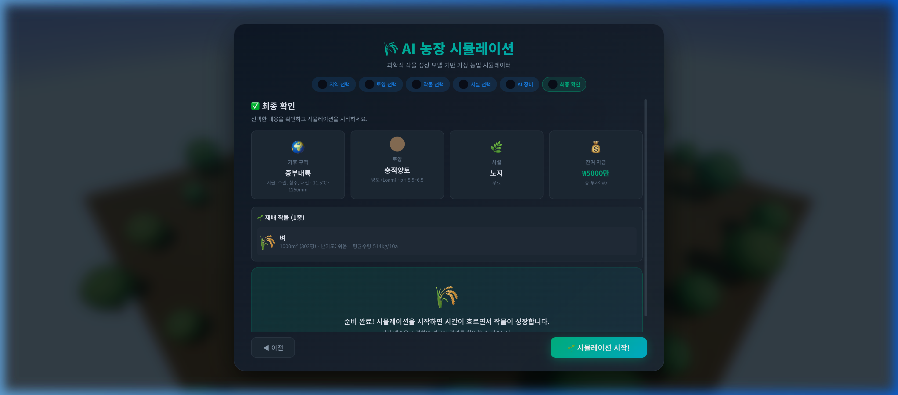
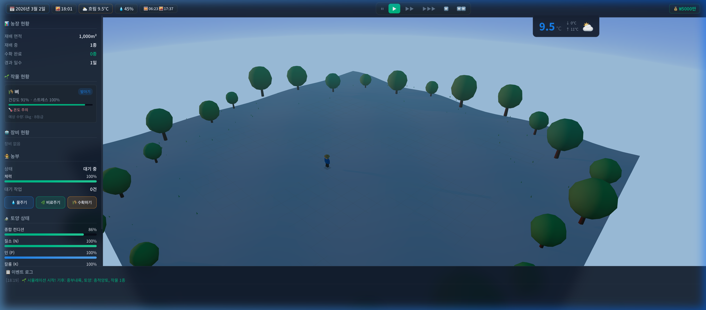

과학적 작물 성장 모델 기반 가상 농업 시뮬레이터

<p align="center">
  
</p>

<h1 align="center">🌾 AI 농장 시뮬레이션</h1>

<p align="center">
  <strong>과학적 작물 성장 모델 기반 가상 농업 시뮬레이터</strong>
</p>

<p align="center">
  <a href="https://choosukkum.vercel.app"></a>
  <br/><br/>
  
  
  
  
  
</p>

---

## 📌 TL;DR

**AI 농장 시뮬레이션**은 DSSAT/APSIM 기반의 **과학적 작물 성장 모델**을 적용한 가상 농업 시뮬레이터입니다. 한국 6개 기후권역 × 7종 토양 × 8종 작물 × 6종 시설 × 6종 AI 장비를 조합하여, 기상 변화·병해충·토양 양분 소모까지 반영한 **사실적인 농업 경영**을 체험할 수 있습니다.

Three.js 기반 3D 농장 시각화와 실시간 시뮬레이션 대시보드로 몰입감 있는 교육·체험형 웹앱을 제공합니다.

> **「실제 농업 과학 데이터로 구동되는 가상 농장」** — 기상청(KMA), FAO-56, 농촌진흥청(NIAS), 통계청 데이터 기반

---

<p align="center">
  
  
</p>

<p align="center">
  <em>좌: 6단계 설정 위저드 (기후→토양→작물→시설→AI장비→확인) &nbsp;|&nbsp; 우: 실시간 시뮬레이션 대시보드</em>
</p>

---

## 📖 Table of Contents

- [프로젝트 배경 및 기획](#-프로젝트-배경-및-기획)
- [핵심 기능](#-핵심-기능)
- [시뮬레이션 엔진 아키텍처](#-시뮬레이션-엔진-아키텍처)
- [과학적 모델 기반](#-과학적-모델-기반)
- [기술적 챌린지 & 해결](#-기술적-챌린지--해결)
- [프로젝트 구조](#-프로젝트-구조)
- [시작하기](#-시작하기)
- [배운 점 & 회고](#-배운-점--회고)
- [로드맵](#-로드맵)

---

## 🧠 프로젝트 배경 및 기획

### 왜 이 프로젝트를 시작했는가

한국의 농업 분야에서 AI/스마트팜 기술이 급속히 도입되고 있지만, 이를 **교육적으로 체험**할 수 있는 시뮬레이터가 부재했습니다. 기존 농업 시뮬레이션 게임은 오락에 치중하여 과학적 근거가 약했고, 학술용 시뮬레이터(DSSAT, APSIM)는 전문가가 아니면 접근이 불가능했습니다.

| 기존 솔루션의 한계 | AI 농장 시뮬레이션의 접근 |
|:---|:---|
| 🔴 오락 위주 (비과학적 성장 모델) | 🟢 **DSSAT/APSIM 기반** GDD 성장 모델 적용 |
| 🔴 기상 데이터 없는 단순 시스템 | 🟢 **기상청 데이터 기반** 6개 기후권역 시뮬레이션 |
| 🔴 토양·양분 시스템 부재 | 🟢 **NPK 양분 소모 + 토양 pH·배수 반영** |
| 🔴 AI 농업 장비 체험 불가 | 🟢 **드론·로봇·자율주행 트랙터** 6종 도입 |
| 🔴 설치 필요한 전문 소프트웨어 | 🟢 **브라우저 기반** Zero-install |

### 핵심 설계 원칙

1. **과학적 정직성**: 모든 수치는 논문·공공데이터에 근거 (DSSAT, FAO-56, 농촌진흥청 농사로, 통계청)
2. **교육적 가치**: 게임을 플레이하면서 실제 농업 과학 지식을 자연스럽게 습득
3. **시각적 몰입**: Three.js 3D 장면으로 농장을 직관적으로 시각화
4. **접근성**: 브라우저만으로 즉시 실행 가능

---

## ✨ 핵심 기능

### 🌍 6단계 시뮬레이션 설정 위저드

- **기후권역 선택**: 중부내륙, 중부해안, 남부내륙, 남부해안, 제주, 고산지 — 각 권역별 월별 기온/강수량 차트 및 자연재해 확률표 제공
- **토양 선택**: 충적양토, 사질양토, 점토, 화산토 등 7종 — pH, 유기물, 배수 특성이 작물 생육에 실시간 반영
- **작물 선택**: 벼, 대파, 배추, 감자, 무, 인삼, 사과, 포도 등 8종 — 난이도 등급 및 예상 수확량 표시
- **시설 선택**: 노지, 비닐하우스, 유리온실, 식물공장 등 6종 — 시설별 환경 제어 수준 차등화
- **AI 장비**: 스카우트 드론, 방제 드론, 제초 로봇, 자율주행 트랙터 등 6종 — 투자 비용 대비 효율 분석

### 🌾 DSSAT/APSIM 기반 작물 성장 엔진

- **GDD(Growing Degree Days) 모델**: 작물별 기본온도(Base Temperature)와 적산온도로 생육 단계 전환
- **생육단계**: 발아기 → 유묘기 → 영양생장기 → 개화기 → 등숙기 → 수확적기 (6단계)
- **바이오매스 분배**: RUE(Radiation Use Efficiency) 기반 일별 광합성량 계산 → 잎/줄기/열매/뿌리 비율 분배
- **LAI(Leaf Area Index)**: 엽면적지수 동적 변화로 광차단(Light Interception) 계산
- **품질 모델**: 일교차·일조량·수분 스트레스 종합→ 당도(Brix)·크기·등급(S/A/B/C/D) 예측

### 🌦️ 확률적 기상 엔진

- **가우시안 분포 기반 일별 기온 생성**: 월 평균에 σ=2.5°C 변동
- **장마 시스템**: 6~7월 장마 확률 모델 (연속 강우 이벤트)
- **극한 기상 이벤트**: 태풍(7~9월), 폭염, 집중호우, 한波, 우박, 서리 — 각 이벤트는 작물에 실제적 피해 반영
- **적설 누적 모델**: 기온 0°C 이하 시 강설 전환, 적설량 누적/융해 시뮬레이션

### 🦠 병해충 시뮬레이션

- **환경 조건 기반 발병**: 온도·습도 범위가 트리거 조건 충족 시 확률적 발생
- **작물별 고유 병해**: 벼 도열병/문고병, 대파 노균병, 포도 노균병 등 실제 병해 모델링
- **피해율·확산**: 발병 후 일별 피해율(damageRate) 적용, 방제 드론으로 방제 가능

### 🤖 AI 농업 장비 시스템

- **스카우트 드론**: NDVI/RGB 카메라 기반 병해충 조기 탐지 (탐지 정확도 85%↑)
- **방제 드론**: DJI Agras 모델 기반, 농약 40% 절감 + 살포 균일도 92%
- **제초 로봇**: AI 비전 잡초 인식, 제초제 사용 90% 절감
- **자율주행 트랙터**: GPS RTK 기반 자동 경운·정지작업
- **수확 로봇**: 과일 성숙도 AI 판단, 선별 정확도 93%
- **환경 센서 네트워크**: 토양 수분·기온·습도 실시간 모니터링

### 🧑‍🌾 농부 시뮬레이션 & 경영

- **3D 캐릭터**: Three.js로 구현된 농부 캐릭터가 농장을 이동하며 작업 수행
- **체력 시스템**: 물주기/비료주기/수확 작업 시 체력 소모, 야간 회복
- **자금 관리**: 초기 자금 ₩5,000만 → 종자/비료/장비 투자 → 수확 수익, 파산 시 Game Over
- **수확물 등급별 가격 차등**: 도매시장 실제 등급별 가격 비율 적용 (S등급 130%, D등급 40%)
- **종합 리포트**: 시뮬레이션 종료 시 재무 성과, 작물 성장 기록, 기상 이벤트 히스토리, 과학적 참고문헌 포함

### 🎮 시뮬레이션 제어

- **시간 제어**: 일시정지, 1×/2×/4×/8× 속도 조절
- **실시간 대시보드**: 기상 정보, 작물 건강도, 스트레스 지표, 토양 양분(NPK), 이벤트 로그
- **전략 패널**: 관수 모드(자동/수동), 비료 시비 전략 설정

---

## 🏗️ 시뮬레이션 엔진 아키텍처

### 전체 아키텍처

```
┌─────────────── Application Layer ─────────────────┐
│                                                    │
│  ┌──────────┐  ┌────────────┐  ┌──────────────┐   │
│  │ main.js  │──│ UIManager  │──│  World3D     │   │
│  │ (Entry)  │  │ (1,277L)   │  │ (949L, 3D)   │   │
│  └────┬─────┘  └────────────┘  └──────────────┘   │
│       │                                            │
│  ┌────┴──────────────────────────────────────┐     │
│  │        SimulationManager (통합 관리)        │     │
│  │  ┌─────────────────┐  ┌────────────────┐  │     │
│  │  │ CropGrowthEngine│  │ WeatherEngine  │  │     │
│  │  │ (721L, DSSAT)   │  │ (309L, 확률적) │  │     │
│  │  └────────┬────────┘  └───────┬────────┘  │     │
│  │           │                   │            │     │
│  │  ┌────────┴───────────────────┴────────┐   │     │
│  │  │         TimeManager (시간 제어)      │   │     │
│  │  └─────────────────────────────────────┘   │     │
│  └────────────────────────────────────────────┘     │
│                                                    │
│  ┌──────────────── Data Layer ────────────────┐    │
│  │  crops(518L) │ soils(217L) │ climate(234L) │    │
│  │  robots(129L)│ facilities(90L)             │    │
│  └────────────────────────────────────────────┘    │
│                                                    │
│  ┌──────────────── Utils Layer ───────────────┐    │
│  │  EventBus │ MathUtils │ Constants │Registry│    │
│  └────────────────────────────────────────────┘    │
└────────────────────────────────────────────────────┘
```

### 핵심 시뮬레이션 루프

```
매 시간 (in-game) Tick:
  ├── TimeManager.update() → 시간 경과 계산
  ├── WeatherEngine.generateDailyWeather() → 일별 기상 생성
  │   ├── 가우시안 기온 변동
  │   ├── 장마·극한 이벤트 판정
  │   └── 적설·서리 계산
  ├── CropGrowthEngine.updateDaily() → 작물 생육 갱신
  │   ├── GDD 적산 → 생육 단계 전환
  │   ├── 스트레스 계산 (수분·온도·양분·광합성)
  │   ├── 바이오매스 생산 (RUE × PAR × LAI)
  │   ├── 양분/수분 소모 갱신
  │   ├── 병해 판정 및 확산
  │   └── 수확량·품질 예측
  ├── UIManager.update() → 대시보드 갱신
  └── World3D.update() → 3D 장면 갱신
```

---

## 📚 과학적 모델 기반

이 시뮬레이터의 모든 수치는 학술 논문과 공공 데이터에 근거합니다:

| 모델 영역 | 참조 | 적용 내용 |
|:---|:---|:---|
| **작물 성장** | DSSAT v4.8 (CERES/CROPGRO) | GDD 적산, 생육 단계 전환, 바이오매스 분배 |
| **증발산량** | FAO-56 Penman-Monteith | 작물계수(Kc) 기반 수분 요구량 |
| **수확량** | 통계청 2024 농업통계 | 벼 514kg/10a 등 실제 평균수확량 기준 |
| **기상** | 기상청(KMA) 관측값 | 6개 권역별 월 평균기온·강수량·일조시간 |
| **토양** | 농촌진흥청(NIAS) 토양환경지도 | 토양 유형별 pH, 유기물, 배수 특성 |
| **병해** | 농촌진흥청 병해충과 | 병해별 발생 조건(온도·습도 범위) |
| **RUE 값** | Kiniry et al. 2001 | C3/C4 작물별 RUE 계수 |
| **시비량** | 농진청 시비처방기준 | 작물별 N-P₂O₅-K₂O 표준 시비량 |

---

## 🔧 기술적 챌린지 & 해결

### 1. GDD 누적 모델의 정밀도

**문제**: 단순 일평균 기온으로 GDD를 계산하면 극한 기온에서 부정확

**해결**: DSSAT의 수정 GDD 공식 적용 — 기본온도 이하에서 0 클램핑, 최적온도 이상에서 감쇠 적용

```javascript
// GDD = max(0, (Tmax + Tmin) / 2 - Tbase)
// + 극한 온도 보정 (DSSAT CERES 방식)
export function calculateGDD(tMax, tMin, tBase, tOpt = 35) {
  const tAvg = (tMax + tMin) / 2;
  const gdd = Math.max(0, tAvg - tBase);
  return tAvg > tOpt ? gdd * (1 - (tAvg - tOpt) / (45 - tOpt)) : gdd;
}
```

### 2. 다중 스트레스 상호작용

**문제**: 수분·온도·양분·광합성 스트레스가 동시에 작용할 때 단순 곱셈은 비현실적

**해결**: 가중 평균 + 최소값 앙상블 방식으로 종합 스트레스 산출

```javascript
const overall = Math.min(
  stress.water * 0.35 + stress.temperature * 0.25 +
  stress.nutrient * 0.25 + stress.light * 0.15,
  Math.min(stress.water, stress.temperature) // 가장 심각한 스트레스가 지배
);
```

### 3. 3D 농장 시각화 성능

**문제**: 1,000m² 농장을 사실적 3D로 렌더링하면서 60fps 유지

**해결**:
- **InstancedMesh**: 동일 형태의 나무·작물을 인스턴싱으로 배치 (draw call 최소화)
- **LOD(Level of Detail)**: 카메라 거리에 따른 디테일 조절
- **Shadow 최적화**: 그림자 맵 해상도 제한 + PCF 소프트 쉐도우

### 4. 확률적 기상 이벤트의 균형

**문제**: 완전 랜덤 기상 이벤트는 게임 밸런스를 파괴

**해결**: 실제 기상청 데이터 기반 확률 설정 + 시뮬레이션 균형을 위한 가드레일

```javascript
// 장마 확률: 6월 30%, 7월 35%로 실제 한국 기상 반영
// 태풍: 7~9월, 권역별 차등 확률 (제주 > 남부해안 > 중부내륙)
// 극한 이벤트: 연속 발생 방지 쿨다운 적용
```

---

## 📁 프로젝트 구조

```
src/
├── main.js                          # 앱 진입점 + 설정 위저드
├── style.css                        # 글로벌 스타일 (다크 테마 UI)
│
├── engine/
│   ├── SimulationManager.js         # 통합 시뮬레이션 관리 (359줄)
│   ├── CropGrowthEngine.js          # DSSAT 기반 작물 성장 엔진 (721줄)
│   ├── WeatherEngine.js             # 확률적 기상 생성 엔진 (309줄)
│   └── TimeManager.js               # 게임 내 시간 제어 (187줄)
│
├── world/
│   ├── World3D.js                   # Three.js 3D 농장 씬 (949줄)
│   └── Farmer3D.js                  # 3D 농부 캐릭터 + 행동 (471줄)
│
├── ui/
│   └── UIManager.js                 # 전체 UI/대시보드 관리 (1,277줄)
│
├── data/
│   ├── crops/index.js               # 8종 작물 데이터 (518줄)
│   ├── soils/index.js               # 7종 토양 데이터 (217줄)
│   ├── climate/index.js             # 6개 기후권역 (234줄)
│   ├── robots/index.js              # 6종 AI 장비 (129줄)
│   └── facilities/index.js          # 6종 시설 유형 (90줄)
│
└── utils/
    ├── Constants.js                 # 생육 단계, 이벤트 타입 상수
    ├── EventBus.js                  # Pub/Sub 이벤트 시스템
    ├── MathUtils.js                 # GDD, 스트레스, 가우시안 분포 유틸
    └── Registry.js                  # 데이터 레지스트리 패턴

21개 파일 | 약 7,100 LOC (JavaScript)
```

---

## 🚀 시작하기

### Prerequisites

- **Node.js** 18+

### 설치

```bash
# 1. 클론
git clone https://github.com/yourusername/aifarmsimu.git
cd aifarmsimu

# 2. 의존성 설치
npm install

# 3. 개발 서버
npm run dev
```

### 빌드

```bash
npm run build
```

---

## 💡 배운 점 & 회고

### 기술적으로 새롭게 배운 것들

#### 1. 과학 시뮬레이션 모델링의 깊이

DSSAT/APSIM 논문을 읽고 GDD 모델, 바이오매스 분배, RUE 기반 광합성 계산을 직접 구현하면서, **실제 농학 연구에서 사용하는 모델의 복잡성**을 체험했습니다. 단순한 "시간이 지나면 자란다"가 아닌, 온도·수분·광합성·양분이 모두 상호작용하는 모델을 설계하는 것이 핵심 챌린지였습니다.

#### 2. 확률적 시스템 설계 (Stochastic Modeling)

기상 엔진에서 가우시안 분포, 조건부 확률(장마 기간 중 강우 확률 70%), 쿨다운 패턴 등을 구현하면서 **확률적 시스템이 결정론적 게임과 어떻게 다른지**를 깊이 이해했습니다. 특히 재현 가능한 시뮬레이션을 위한 시드 관리의 중요성을 배웠습니다.

#### 3. Vanilla JS + Three.js의 가능성

프레임워크 없이 순수 JavaScript와 Three.js만으로 복잡한 시뮬레이션 엔진 + 3D 시각화 + 풍부한 UI를 구현할 수 있다는 것을 증명했습니다. EventBus 패턴과 Registry 패턴으로 **프레임워크 수준의 구조적 설계**를 달성했습니다.

#### 4. 데이터 기반 게임 설계

8종 작물 × 7종 토양 × 6개 기후 × 6종 시설의 조합에서 모든 상호작용이 데이터 테이블에 의해 구동되도록 설계함으로써, **새 작물/토양 추가가 코드 변경 없이 데이터만으로 가능**한 확장 구조를 구현했습니다.

### 아쉬운 점 & 개선 방향

- **멀티플레이어 미지원**: 농장 경영 대결, 협동 농업 등 소셜 기능 추가 검토
- **모바일 최적화**: 3D 농장 씬이 모바일 GPU에서 부담 → WebGL LOD / 2D 폴백 모드 필요
- **저장/불러오기**: 현재 세션 기반 → localStorage/Firebase 기반 세이브 시스템 도입 필요
- **AI 어드바이저**: 현재 장비만 제공 → 작물 추천, 시비 최적화 등 AI 기반 농업 컨설팅 기능 추가

---

## 🗺️ 로드맵

- [x] 6단계 설정 위저드
- [x] DSSAT 기반 작물 성장 엔진 (GDD, 스트레스, 바이오매스)
- [x] 확률적 기상 엔진 (장마, 태풍, 한파, 우박)
- [x] Three.js 3D 농장 시각화
- [x] 농부 3D 캐릭터 + 체력/작업 시스템
- [x] AI 장비 6종 (드론, 로봇, 자율주행)
- [x] 병해충 시뮬레이션
- [x] 자금 관리 + 수확 수익 (등급별 가격)
- [x] 종합 리포트 (재무·성장·기상·참고문헌)
- [ ] 세이브/로드 시스템
- [ ] 멀티플레이어 (협동/경쟁)
- [ ] AI 농업 컨설팅 어드바이저
- [ ] 모바일 최적화
- [ ] 연간 시뮬레이션 (다년작 과수원 경영)

---

## 📄 라이선스

이 프로젝트는 개인 프로젝트이며, 모든 권리는 저작자에게 있습니다.

---

<p align="center">
  <br/>
  <strong>AI 농장 시뮬레이션</strong> — 과학으로 농사짓다 🌱
  <br/><br/>
  <sub>Made with ❤️ and lots of ☕</sub>
</p>
