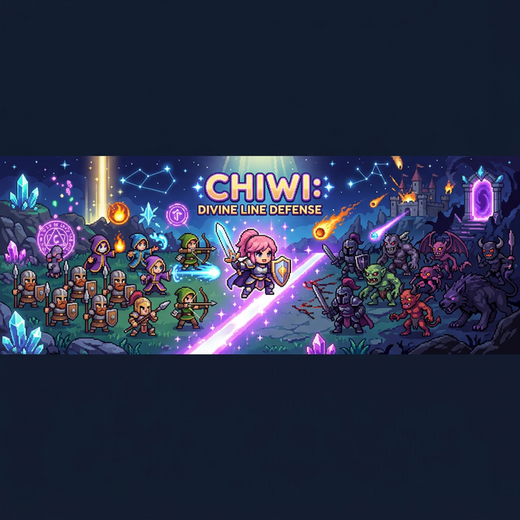
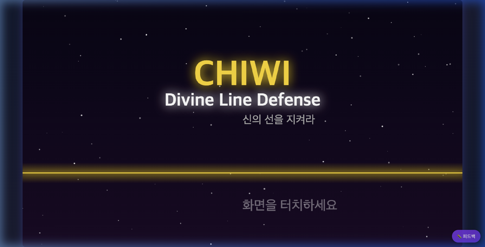
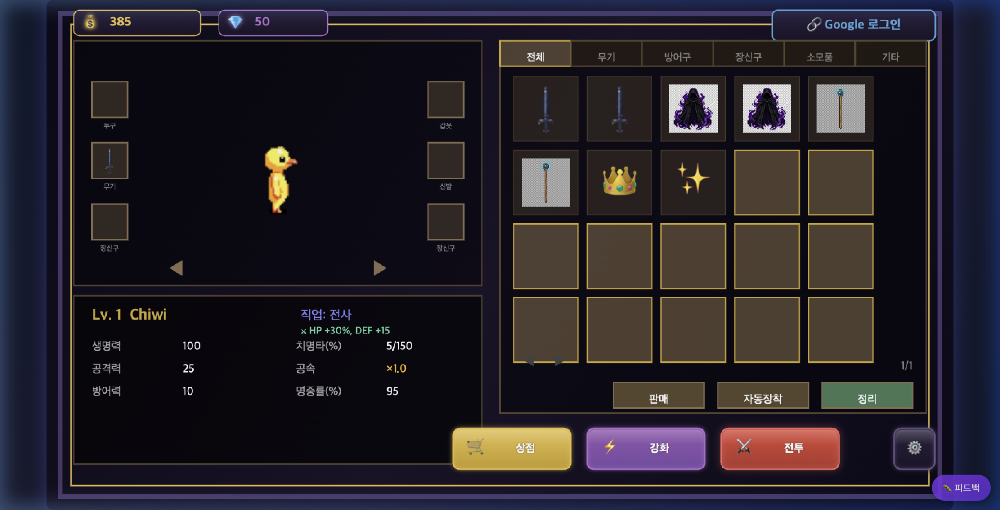
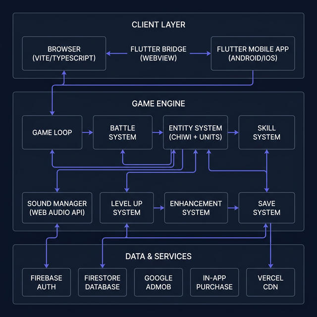

<div align="center">



# ⚔️ Chiwi: Divine Line Defense

**2D 픽셀 아트 라인 디펜스 RPG — 웹과 모바일의 크로스 플랫폼 게임**

[](https://www.typescriptlang.org/)
[](https://vitejs.dev/)
[](https://firebase.google.com/)
[](https://flutter.dev/)
[](https://chiwi-pixel-rpg.vercel.app/)
[]()

> **신적 관리자 Chiwi가 되어 전장을 지휘하세요!**  
> 다양한 직업, 장비, 스킬로 전략적인 전투를 즐기는 2D 픽셀 아트 라인 디펜스 RPG.

[🎮 지금 플레이하기](https://chiwi-pixel-rpg.vercel.app/) · [📱 Google Play](https://play.google.com/store/apps/) · [🍎 App Store](https://apps.apple.com/)

</div>

---

## 📋 목차

- [프로젝트 개요](#-프로젝트-개요)
- [스크린샷](#-스크린샷)
- [기획 의도 및 아이디어의 출발점](#-기획-의도-및-아이디어의-출발점)
- [비즈니스 모델](#-비즈니스-모델)
- [기술 스택 및 아키텍처](#-기술-스택-및-아키텍처)
- [핵심 시스템 설계](#-핵심-시스템-설계)
- [기술적 도전과 해결 과정](#-기술적-도전과-해결-과정)
- [게임 콘텐츠 개요](#-게임-콘텐츠-개요)
- [프로젝트 구조](#-프로젝트-구조)
- [개발 환경 설정](#-개발-환경-설정)
- [새롭게 배운 점](#-새롭게-배운-점)
- [향후 로드맵](#-향후-로드맵)

---

## 🎯 프로젝트 개요

**Chiwi: Divine Line Defense**는 고전 라인 디펜스의 전략적 재미와 현대 RPG의 성장 시스템을 결합한 2D 픽셀 아트 게임입니다. 플레이어는 신적 관리자 "치위(Chiwi)"가 되어 수호 정령들을 소환하고, 직접 전투에 참여하며, 어둠의 세력으로부터 "Divine Line"을 지켜야 합니다.

### 핵심 수치

| 항목 | 수치 |
|------|------|
| **웹 게임 코드** | 55개 TypeScript 파일, ~25,600 LOC |
| **모바일 앱 코드** | 8개 Dart 파일, ~1,280 LOC |
| **게임 시스템** | 17개 독립 시스템 모듈 |
| **UI 스크린** | 15개 (인트로 → 로비 → 전투 → 결과) |
| **캐릭터 직업** | 5종 (전사, 마법사, 궁수, 어쌔신, 거너) |
| **무기** | 18종 (직업당 3~4개) |
| **전투 필드** | 10개 테마 (숲, 화산, 빙하, 사막, 늪 등) |
| **보스** | 10종 (필드별 고유 보스) |
| **장비** | 100종+ (5등급 × 5부위) |
| **밸런스 테스트** | 341+ 자동 검증 테스트 케이스 |

---

## 📸 스크린샷

<div align="center">

### 🏠 타이틀 화면

*인트로 화면 — 다크 테마, Divine Line, 터치하면 바로 로비 진입*

### 🎒 로비 & 인벤토리

*캐릭터 장비, 스탯, 인벤토리, 상점/강화/전투 버튼이 통합된 로비 UI*

</div>

---

## 💡 기획 의도 및 아이디어의 출발점

### "왜 라인 디펜스 + RPG인가?"

15년간 다양한 프로젝트를 거치면서 항상 품고 있던 질문이 있었습니다: **"웹 기술만으로 네이티브 게임 수준의 경험을 만들 수 있을까?"** 이 프로젝트는 그 질문에 대한 실험이자 답변입니다.

**라인 디펜스** 장르를 선택한 이유는 명확합니다:
1. **낮은 진입장벽**: 조작이 단순하여 캐주얼 유저도 쉽게 접근
2. **깊은 전략성**: 유닛 조합, 스킬 타이밍, 자원 관리의 깊이
3. **성장의 재미**: RPG 시스템과의 결합으로 장기 플레이 유도
4. **기술적 적합성**: Canvas 2D로도 충분히 구현 가능한 장르

### 세계관 설계 철학

> *"Divine Line이 무너지면, 모든 것이 끝나. 하지만 난 포기하지 않아 — 내 친구들과 함께라면!"* — 치위

"아르카디아(Arcadia)"라는 세계관에서 **빛과 어둠의 경계선(Divine Line)**을 지킨다는 설정은 라인 디펜스 장르의 본질과 완벽하게 맞닿아 있습니다. 게임의 모든 메커니즘(방어선 수비, 유닛 소환, 보스 격파)이 내러티브와 유기적으로 연결되도록 기획했습니다.

---

## 💰 비즈니스 모델

### 수익화 전략: "Pay-to-Skip, Not Pay-to-Win"

게임의 핵심 재미를 유료화 뒤에 숨기지 않는다는 원칙을 세웠습니다. 모든 콘텐츠는 플레이를 통해 획득 가능하며, 유료 요소는 **시간 단축**에 초점을 맞췄습니다.

```
┌─────────────────────────────────────────────────────┐
│                    수익 구조                         │
├─────────────┬───────────────────────────────────────┤
│ 광고 수익   │ 리워드 광고 (선택적 시청 → 보상)        │
│             │ - 웹: Google Ad Placement API          │
│             │ - 모바일: AdMob Rewarded Ads           │
├─────────────┼───────────────────────────────────────┤
│ 인앱 구매   │ 크리스탈 팩 (게임 내 재화)              │
│             │ - 소모성 아이템 (crystal_pack_100 등)   │
│             │ - iOS 구매 복원 기능 구현               │
├─────────────┼───────────────────────────────────────┤
│ 플랫폼 전략 │ 웹 → 유저 유입 (SEO, 무료 플레이)      │
│             │ 모바일 → 수익 전환 (광고 + IAP)         │
└─────────────┴───────────────────────────────────────┘
```

### 플랫폼별 수익화 차이

| | 웹 (Vercel) | 모바일 (Flutter) |
|---|---|---|
| **광고** | Google Ad Placement API | AdMob Rewarded Ads |
| **결제** | - | 인앱 구매 (in_app_purchase) |
| **목적** | 유저 확보 & SEO 유입 | 핵심 수익 채널 |
| **특이사항** | 카운트다운 폴백 광고 | ATT(iOS), 구매 복원 |

> **결정적 교훈**: 웹에서는 AdSense가 안정적이지 않아 카운트다운 폴백을 구현해야 했습니다. 모바일 전환이 수익화에 있어 훨씬 효과적입니다.

---

## 🏗️ 기술 스택 및 아키텍처

### 시스템 아키텍처



### 기술 스택 상세

| 영역 | 기술 | 선택 이유 |
|------|------|-----------|
| **게임 엔진** | Canvas 2D API | 프레임워크 없이 완전한 제어권 확보 |
| **언어** | TypeScript 5.9 | 25,000줄+ 코드베이스에서 타입 안전성 필수 |
| **번들러** | Vite 7.2 | HMR로 게임 개발 시 빠른 이터레이션 |
| **인증/DB** | Firebase Auth + Firestore | Google 소셜 로그인, 실시간 동기화 |
| **음향** | Web Audio API | 외부 에셋 없이 프로시저럴 사운드 합성 |
| **모바일** | Flutter + InAppWebView | 단일 코드베이스로 iOS/Android 동시 대응 |
| **광고** | AdMob + Ad Placement API | 네이티브/웹 환경별 최적화된 광고 SDK |
| **결제** | in_app_purchase 3.2 | 스토어 검수 필수 요구사항 |
| **배포** | Vercel (웹) + Firebase Hosting | 글로벌 CDN, 자동 빌드 |
| **스프라이트** | PixelLab API | AI 기반 픽셀아트 생성 자동화 |
| **테스트** | tsx + 커스텀 검증 스크립트 | 341+ 밸런스 테스트 자동화 |

### "왜 게임 엔진을 쓰지 않았나?"

Phaser, PixiJS, Unity WebGL 등 검토했지만, 최종적으로 **Vanilla Canvas 2D**를 선택했습니다:

1. **번들 사이즈**: 외부 엔진 없이 빌드 산출물 최소화 → 모바일 WebView 로딩 속도 개선
2. **학습 곡선**: 엔진 API 학습 대신 Canvas/Web Audio 네이티브 API 숙달 → 범용적 역량
3. **완전한 제어**: 게임 루프, 렌더링 파이프라인, 입력 처리를 100% 직접 구현
4. **디버깅**: 블랙박스 없이 모든 레이어를 추적 가능

> 물론 트레이드오프가 있습니다. 스프라이트 시트 관리, 충돌 감지, 파티클 시스템 등을 직접 구현해야 했고, 이 과정에서 약 5,000줄의 렌더링/애니메이션 코드가 발생했습니다.

---

## 🔧 핵심 시스템 설계

### 1. 게임 루프 & 상태 머신

```typescript
// 13개의 명시적 게임 상태 (ExtendedGameState enum)
enum ExtendedGameState {
    INTRO, MENU, LOBBY, CLASS_SELECT, SHOP,
    ENHANCE, BATTLE, VICTORY, DEFEAT,
    LOGIN_CHOICE, SETTINGS, FIELD_SELECT, UNIT_SELECT
}
```

`requestAnimationFrame` 기반의 게임 루프에서 `deltaTime`을 사용한 프레임 독립적 업데이트를 구현했습니다. 상태 전환은 명시적 enum으로 관리하여 **전이 중 발생하는 엣지 케이스**(예: 전투 중 일시정지 → 설정 → 복귀)를 안전하게 처리합니다.

### 2. 전투 시스템 (Battle.ts — 1,753 lines)

전투 시스템은 이 프로젝트에서 가장 복잡한 모듈입니다:

```
┌─────────────── Battle Loop (매 프레임) ─────────────────┐
│                                                          │
│  ① 적 스폰 (웨이브 기반 + 20초 간격 보스)                │
│  ② 유닛 AI (이동 → 탐색 → 공격 → 특수효과)              │
│  ③ 데미지 계산 (물리/마법/고정 + 방어/저항)              │
│  ④ 상태효과 처리 (기절/빙결/화상/독/슬로우/넉백)         │
│  ⑤ 카메라 추적 (Chiwi 기준 + 보간)                      │
│  ⑥ 스킬 이펙트 업데이트 (파티클 + 투사체)                │
│  ⑦ 레벨업 판정 (XP → 어드밴티지 선택)                   │
│  ⑧ 보스 드롭 & 장비 획득 처리                            │
│  ⑨ 승/패 판정 (기지 HP 기반)                             │
│                                                          │
│  렌더링: 배경 → 지면 → 유닛 → 이펙트 → HUD → 오버레이    │
└──────────────────────────────────────────────────────────┘
```

### 3. 데미지 계산 파이프라인

```typescript
// DamageCalculator.ts — 3단계 데미지 계산
Raw Damage → (1) 타입별 방어 적용 → (2) 치명타 판정 → (3) 최종 데미지
             │ physical: DEF 감소    │ critChance     │ 넉백/기절/빙결
             │ magic: MR 감소        │ critMultiplier │ 화상/독/슬로우
             │ true: 방어 무시       │                │
```

### 4. 프로시저럴 사운드 시스템 (SoundManager.ts — 1,607 lines)

게임의 모든 사운드를 **Web Audio API만으로** 실시간 합성합니다. 외부 오디오 파일 **0개**:

- **무기별 고유 사운드**: 검(15종), 활(3종), 총(3종), 마법(3종), 암기(1종)
- **이펙트**: 공격, 피격, 크리티컬, 회피, 소환, 레벨업, 보스 경고
- **기술적 구현**: `OscillatorNode` + `GainNode` + `DynamicsCompressorNode` 조합
- **최적화**: 사운드 풀링, 마스터 볼륨 제어, 뮤트 토글

```typescript
// 예시: 카타나 베기 사운드 — 날카로운 고주파 + 빠른 감쇠
playKatanaAttack(): void {
    const osc = ctx.createOscillator();
    osc.type = 'sawtooth';
    osc.frequency.setValueAtTime(800, now);
    osc.frequency.exponentialRampToValueAtTime(200, now + 0.08);
    // ... 엔벨로프, 필터, 공간감 처리
}
```

### 5. 세이브 시스템 (SaveSystem.ts — 707 lines)

**"데이터를 잃으면 유저를 잃는다"** — 3중 안전망 설계:

```
┌─ 저장 전략 ──────────────────────────────────────────┐
│                                                        │
│  1차: Firebase Firestore (클라우드, 계정 연동)          │
│  2차: localStorage (오프라인 폴백)                      │
│  3차: 디바운스 큐 (빈번한 저장 → 배치 처리)             │
│                                                        │
│  로드 시: 타임스탬프 비교 → 가장 최신 데이터 사용        │
│  충돌 해결: 클라우드 vs 로컬 타임스탬프 비교             │
│  Migration: version 필드 기반 스키마 마이그레이션         │
└────────────────────────────────────────────────────────┘
```

### 6. Flutter Bridge — 웹↔네이티브 통신

모바일 앱은 Flutter WebView 내에서 웹 게임을 렌더링하되, 네이티브 기능이 필요한 경우 **브릿지 패턴**으로 통신합니다:

```typescript
// 환경 자동 감지
isInApp(): boolean {
    return !!(window.FlutterBridge || (window as any).flutter_inappwebview);
}

// 리워드 광고: 환경별 분기
requestRewardedAd(): void {
    if (this.isInApp()) {
        // Flutter → 네이티브 AdMob
        window.FlutterBridge?.postMessage(JSON.stringify({ type: 'showRewardedAd' }));
    } else {
        // 웹 → Google Ad Placement API → 카운트다운 폴백
        this._showWebRewardedAd();
    }
}
```

### 7. 밸런스 검증 시스템 (verify-balance.ts — 52,204 bytes)

수동 밸런싱은 인간의 인지 한계를 빠르게 초과합니다. 10개 필드 × 5개 직업 × 18개 무기 × 3단계 난이도의 조합을 사람이 모두 확인하는 것은 불가능합니다.

```bash
npm run test:balance  # 341+ 자동 검증 테스트 실행
```

검증 항목:
- 필드 HP/ATK/XP 배율의 단조 증가 (곡선 무결성)
- 보스 EHP(유효 체력) 기하급수 성장 검증
- 5개 직업 무기 DPS 일관성 (같은 직업 내 ±20%)
- 물리 직업간 DPS 비율 (≤ 2.5x)
- 스킬 DPS/s, 쿨다운 계층, 특성(trait) 범위
- 레벨업 XP 곡선 검증

---

## 🤔 기술적 도전과 해결 과정

### 1. Canvas 2D에서 60fps 유지하기

**문제:** 40+ 유닛이 동시에 전투하면서 파티클 이펙트, 데미지 넘버, HUD를 렌더링할 때 프레임 드랍 발생

**해결:**
- 렌더링 레이어 분리: 배경(정적) → 지면(타일) → 엔티티(동적) → 이펙트 → HUD
- 화면 밖 엔티티 렌더링 스킵 (카메라 기반 뷰포트 컬링)
- 파티클 풀링: 생성/소멸 비용 제거
- `requestAnimationFrame` + `deltaTime` 기반 프레임 독립 업데이트

### 2. 모바일 터치 입력 최적화

**문제:** Canvas 게임에서 터치 이벤트를 받으면 기본 브라우저 동작(스크롤, 줌)이 간섭

**해결:**
```typescript
// 뷰포트 고정 (1280px 기준 자동 스케일)
<meta name="viewport" content="width=1280, initial-scale=1, maximum-scale=1, user-scalable=no" />

// Canvas 좌표 변환 (스케일링/레터박싱 보정)
getCanvasCoordinates(clientX, clientY): { x, y } {
    const rect = this.canvas.getBoundingClientRect();
    return {
        x: (clientX - rect.left) * (CANVAS_WIDTH / rect.width),
        y: (clientY - rect.top) * (CANVAS_HEIGHT / rect.height)
    };
}
```
- 가상 조이스틱(VirtualJoystick.ts) 구현으로 Chiwi 이동 제어
- `touch-action: none` + `-webkit-user-select: none` 으로 브라우저 간섭 차단

### 3. PixelLab API를 활용한 스프라이트 생성 자동화

**문제:** 10종 보스 + 13종 적 + 5종 직업의 애니메이션 스프라이트를 수동 제작하는 것은 비현실적

**해결:** PixelLab API를 활용한 자동 생성 파이프라인 구축:
```
기획 (캐릭터 설정 문서) → 프롬프트 생성 → API 호출 → 
PNG 다운로드 → 스프라이트시트 조합(Sharp) → 게임 적용
```
- `scripts/download-new-bosses.mjs`, `scripts/pixellab-generate-boss-animations.mjs` 등 전용 스크립트
- 실패 시 재시도 로직 내장 (`pixellab-download-pending.mjs`)

### 4. 앱 스토어 심사 대응

**Apple App Store / Google Play Store** 심사를 위해 필요한 사항들:

| 요구사항 | 구현 |
|----------|------|
| ATT (App Tracking Transparency) | `app_tracking_transparency` 패키지 + 권한 요청 |
| 계정 삭제 기능 | Firebase Auth 계정 삭제 + Firestore 데이터 삭제 |
| 구매 복원 (iOS) | `restorePurchases()` 구현 |
| 개인정보처리방침 | 한/영 버전 HTML (`privacy.html`, `privacy-en.html`) |
| 이용약관 | 한/영 버전 HTML (`terms.html`, `terms-en.html`) |
| ProGuard 설정 | WebView, AdMob, IAP 관련 클래스 난독화 제외 |

### 5. SEO & 크롤러 대응

Canvas 기반 SPA 게임은 크롤러가 콘텐츠를 읽을 수 없는 치명적 약점이 있습니다.

**해결:**
- `<noscript>` 블록에 게임 설명, 특징, 링크를 HTML로 삽입
- JSON-LD 구조화 데이터 (`VideoGame` 스키마)
- Open Graph / Twitter Card 메타 태그
- `robots.txt` + `sitemap.xml` 생성
- 정적 페이지: `about.html`, `privacy.html`, `terms.html`

---

## 🎮 게임 콘텐츠 개요

### 5종 직업 시스템

| 직업 | 무기(3~4종) | 특성 | 스타일 |
|------|-------------|------|--------|
| ⚔️ **전사** | 장검, 대검, 카타나, 전투도끼 | HP+20%, DEF+5, 흡혈 3% | 근접 탱커/딜러 |
| 🔮 **마법사** | 지팡이, 오브, 마력서 | 스킬뎀+30%, MAG 기반 | 원거리 마법 딜러 |
| 🏹 **궁수** | 장궁, 단궁, 석궁 | 사거리+50, 공속 보너스 | 원거리 물리 딜러 |
| 🗡️ **어쌔신** | 단검, 쌍검, 수리검 | 치명타+20%, 회피+15% | 고DPS 암살자 |
| 🔫 **거너** | 소총, 산탄총, 기관단총 | 관통, 넓은 범위공격 | 원거리 연사 딜러 |

### 10개 테마 필드

| 필드 | 테마 | HP 배율 | 보스 |
|------|------|---------|------|
| 1. 푸른 숲 🌲 | Forest | ×1.0 | 숲의 수호자 |
| 2. 붉은 황야 🌋 | Volcano | ×1.3 | 화염 군주 |
| 3. 얼음 협곡 ❄️ | Ice | ×1.6 | 서리 거인 |
| 4. 황폐한 사막 🏜️ | Desert | ×2.0 | 사막의 왕 |
| 5. 독의 늪 ☠️ | Swamp | ×2.5 | 독 여왕 |
| 6. 어둠의 숲 🌑 | Dark | ×3.0 | 그림자 군주 |
| 7. 하늘 섬 ⛅ | Sky | ×3.6 | 번개 용 |
| 8. 고대 유적 🏛️ | Ruins | ×4.3 | 고대 골렘 |
| 9. 심연의 구덩이 👁️ | Abyss | ×5.1 | 심연의 존재 |
| 10. 혼돈의 영역 💀 | Chaos | ×6.0 | 혼돈의 화신 |

### 장비 & 강화 시스템

**5단계 등급:** 노말(회색) → 고급(초록) → 희귀(파랑) → 영웅(보라) → 전설(주황)

**5부위 장착:** 무기 · 투구 · 갑옷 · 신발 · 장신구

**강화 시스템 (+0 ~ +10):**
- +1~+3: 100%~90% 성공률, 파괴 없음
- +4~+6: 80%~70% 성공률, 축복석 필요
- +7~+10: 60%~30% 성공률, **보호석 없으면 장비 파괴**

---

## 📁 프로젝트 구조

```
chiwiPixelRpg/
├── src/                        # 웹 게임 소스 (TypeScript)
│   ├── game/                   # 핵심 게임 로직
│   │   ├── Game.ts             # 메인 게임 클래스 (1,986 lines)
│   │   ├── Battle.ts           # 전투 시스템 (1,753 lines)
│   │   └── types.ts            # 타입 정의 & 상수
│   ├── entities/               # 게임 엔티티
│   │   ├── Chiwi.ts            # 플레이어 캐릭터 (1,496 lines)
│   │   ├── Unit.ts             # 아군/적 유닛
│   │   ├── Base.ts             # 기지
│   │   └── Tower.ts            # 타워
│   ├── systems/                # 게임 시스템 (17개)
│   │   ├── SoundManager.ts     # 프로시저럴 사운드 (1,607 lines)
│   │   ├── Skill.ts            # 스킬 시스템 (1,120 lines)
│   │   ├── SaveSystem.ts       # 세이브/로드 (707 lines)
│   │   ├── LevelUp.ts          # 레벨업 & 어드밴티지
│   │   ├── Enhancement.ts      # 장비 강화
│   │   ├── DamageCalculator.ts  # 데미지 공식
│   │   ├── DamageNumber.ts     # 플로팅 데미지
│   │   ├── AnimationSystem.ts  # 스프라이트 애니메이션
│   │   ├── Camera.ts           # 카메라 추적
│   │   ├── BattleReward.ts     # 전투 보상
│   │   ├── BossDrop.ts         # 보스 드롭
│   │   ├── HitEffects.ts       # 타격 이펙트
│   │   ├── SkillCutscene.ts    # 스킬 연출
│   │   ├── PlayerStats.ts      # 스탯 관리
│   │   ├── EquipmentEffectManager.ts  # 장비 효과
│   │   ├── Resource.ts         # 자원 관리
│   │   └── i18n.ts             # 다국어 지원
│   ├── ui/                     # UI 스크린 (15개)
│   │   ├── Lobby.ts            # 메인 로비 (59,499B)
│   │   ├── Shop.ts             # 상점
│   │   ├── EnhancementUI.ts    # 강화 작업장
│   │   ├── HUD.ts              # 전투 HUD
│   │   ├── FieldSelection.ts   # 필드 선택
│   │   └── ...                 # 기타 UI 스크린
│   ├── data/                   # 게임 데이터 (정적)
│   │   ├── balanceConfig.ts    # 중앙 밸런스 설정
│   │   ├── classes.ts          # 5종 직업 정의
│   │   ├── equipment.ts        # 100종+ 장비
│   │   ├── bosses.ts           # 10종 보스
│   │   ├── fields.ts           # 10개 필드
│   │   └── units.ts            # 소환 유닛
│   ├── bridge/                 # 플랫폼 브릿지
│   │   └── flutterBridge.ts    # Flutter ↔ 웹 통신
│   ├── config/                 # 설정
│   │   └── firebase.ts         # Firebase 초기화
│   └── utils/                  # 유틸리티
│       └── SpriteLoader.ts     # 스프라이트 로더
├── chiwi_app/                  # Flutter 모바일 앱
│   ├── lib/
│   │   ├── main.dart           # 앱 엔트리포인트
│   │   ├── screens/            # 게임 화면, 오프라인 화면
│   │   ├── services/           # AdMob, IAP, 세이브 서비스
│   │   └── bridge/             # 네이티브 브릿지
│   ├── android/                # Android 빌드 설정
│   └── ios/                    # iOS 빌드 설정
├── scripts/                    # 개발 도구
│   ├── verify-balance.ts       # 밸런스 검증 (52K)
│   ├── download-new-bosses.mjs # PixelLab 보스 다운로드
│   └── create-all-spritesheets.mjs  # 스프라이트시트 생성
├── public/                     # 정적 에셋
│   ├── sprites/                # 스프라이트 이미지
│   ├── assets/                 # 배경, 지면 타일
│   └── *.html                  # SEO 페이지
├── docs/                       # 문서
│   ├── worldbuilding.md        # 세계관 설정
│   └── screenshots/            # 스크린샷
├── index.html                  # SPA 엔트리 (SEO + JSON-LD)
├── firebase.json               # Firebase 호스팅 설정
└── vercel.json                 # Vercel 배포 설정
```

---

## 🚀 개발 환경 설정

### 필수 요구사항

- **Node.js** 18+
- **npm** 9+
- **Flutter** 3.10+ (모바일 앱 빌드 시)

### 웹 게임 실행

```bash
# 의존성 설치
npm install

# 개발 서버 실행 (HMR 지원)
npm run dev

# 프로덕션 빌드
npm run build

# 빌드 미리보기
npm run preview

# 밸런스 검증 테스트
npm run test:balance
```

### 환경 변수 설정

`.env.example`을 `.env.local`로 복사하고 Firebase 프로젝트 설정을 입력합니다:

```env
VITE_FIREBASE_API_KEY=your_api_key
VITE_FIREBASE_AUTH_DOMAIN=your_project.firebaseapp.com
VITE_FIREBASE_PROJECT_ID=your_project_id
VITE_FIREBASE_STORAGE_BUCKET=your_project.appspot.com
VITE_FIREBASE_MESSAGING_SENDER_ID=your_sender_id
VITE_FIREBASE_APP_ID=your_app_id
```

### 모바일 앱 빌드

```bash
cd chiwi_app

# 의존성 설치
flutter pub get

# 개발 실행
flutter run

# APK 빌드
flutter build apk --release

# iOS 빌드
flutter build ios --release
```

---

## 📚 새롭게 배운 점

### 1. Web Audio API의 가능성과 한계

1,607줄의 프로시저럴 사운드 시스템을 만들면서 **OscillatorNode의 파형 조합만으로도** 검 소리, 활 시위 소리, 총성, 마법 소리를 그럴듯하게 합성할 수 있다는 사실을 배웠습니다. 다만 모바일 브라우저에서 `AudioContext`는 사용자 인터랙션 없이 생성하면 자동 일시정지되므로, 최초 터치/클릭 이벤트에서 `resume()`을 호출해야 합니다.

### 2. Canvas 2D 성능 최적화는 "하지 않는 것"이 핵심

가장 효과적인 최적화는 렌더링 자체를 줄이는 것이었습니다. 화면 밖 엔티티 스킵, 정적 배경 캐싱, 텍스트 렌더링 최소화 등 **"렌더링하지 않는"** 전략이 가장 효과적이었습니다.

### 3. "하나의 코드, 두 개의 플랫폼"은 신화

Flutter WebView + 웹 게임 조합으로 크로스 플랫폼을 달성했지만, 실제로는 **광고**, **결제**, **세이브**, **진동**, **권한 관리** 등 플랫폼별 분기가 상당합니다. `flutterBridge.ts`의 모든 함수가 `isInApp()` 체크로 시작하는 것이 이를 증명합니다.

### 4. 게임 밸런스는 수학이지, 감이 아니다

5개 직업 × 18개 무기의 DPS 밸런싱을 "플레이해보고 조정"하려 했던 초기 접근은 실패했습니다. `balanceConfig.ts`로 모든 수치를 중앙화하고, `verify-balance.ts`로 341개 테스트를 자동화한 후에야 **시스템적으로 밸런스를 유지**할 수 있었습니다. 직업 간 DPS 비율을 2.5배 이내로 제한하는 것은 수학적 제약이지 직관이 아닙니다.

### 5. AI 기반 에셋 생성은 게임 체인저

PixelLab API를 통해 보스 스프라이트 10종의 idle/walk/attack 애니메이션을 생성하는 데 수동 작업 대비 **약 90% 시간 절약**을 달성했습니다. 물론 AI 생성 결과물의 일관성 문제(색상 팔레트, 크기, 스타일 통일)를 해결하기 위한 후처리 스크립트가 별도로 필요했습니다.

### 6. 스토어 심사는 "코딩"이 아니라 "규정 준수"

App Store와 Play Store 심사에서 기술적 결함보다 **정책 미준수**(ATT 팝업 누락, 계정 삭제 기능 부재, 구매 복원 미구현)로 리젝되는 경우가 훨씬 많습니다. 개발 초기부터 스토어 가이드라인을 체크리스트로 관리해야 합니다.

---

## 🗺️ 향후 로드맵

- [ ] **PvP 대전 모드** — Firebase Realtime Database 기반 실시간 대전
- [ ] **길드 시스템** — 협동 보스 레이드
- [ ] **시즌 시스템** — 주기적 밸런스 패치 + 한정 보상
- [ ] **신규 직업 추가** — 힐러/탱커 특화 직업
- [ ] **업적 시스템** — 보스 처치 횟수, 콤보 기록 등
- [ ] **오프라인 보상** — 자동 전투 & 방치형 수익
- [ ] **WebSocket 기반 실시간 동기화** — Firestore 비용 최적화

---

<div align="center">

### 🛠️ Built with ❤️ and Lots of Coffee

**Chiwi Game Studio** · 2024–2026

[🎮 Play Now](https://chiwi-pixel-rpg.vercel.app/) · [🐛 Report Bug](mailto:tmddud333@naver.com) · [💡 Request Feature](mailto:tmddud333@naver.com)

</div>
