# 🌐 KLS Connect

### 한국학교 동문 네트워크 플랫폼

**Next.js 웹 앱 · Expo React Native 모바일 앱 · Firebase 공유 백엔드**

[](https://nextjs.org/)
[](https://expo.dev/)
[](https://firebase.google.com/)
[](https://www.typescriptlang.org/)
[](https://vercel.com/)
[](#)

</div>

---

## � 요약

**KLS Connect**는 한국학교(KLS) 동문 커뮤니티를 위한 **풀스택 크로스플랫폼 네트워크 서비스**입니다.
기독교 공동체 기반의 동문 조직이라는 특수성을 고려하여, **순수 커뮤니티 활성화 + 장기적 멤버십 기반 수익 모델**을 설계하고, **웹과 모바일 앱을 단일 Firebase 백엔드로 통합**하는 아키텍처를 구현했습니다.

> 15년간 다양한 프로젝트를 진행하면서도, 기획 → 설계 → 구현 → 배포 → 스토어 출시까지 **1인 풀스택으로 완결**한 프로젝트는 이번이 처음이었습니다. 
> 이 과정에서 내린 기술적 판단과 트레이드오프, 새롭게 배운 교훈들을 이 문서에 상세히 기록합니다.

---

## 📸 스크린샷

### 📱 모바일 앱 (iOS)

<div align="center">
<table>
<tr>
<td align="center">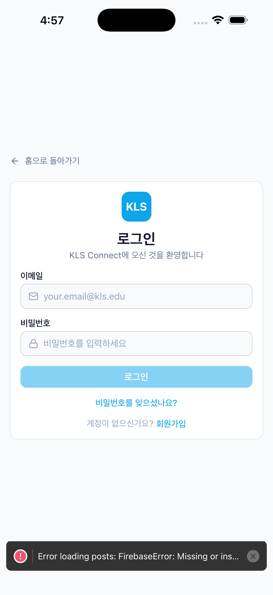<br/><b>로그인</b></td>
<td align="center">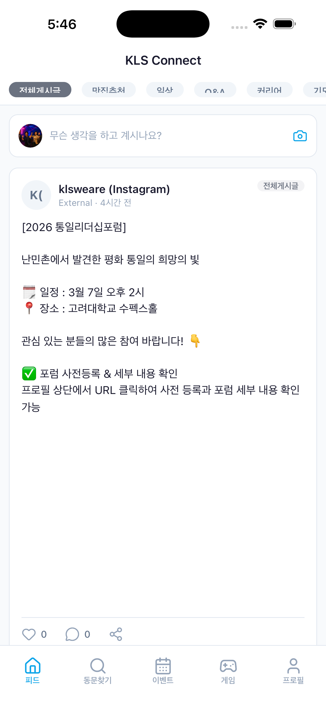<br/><b>추천 피드</b></td>
<td align="center">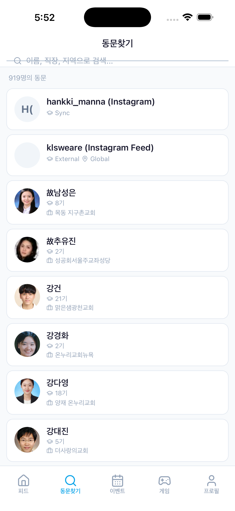<br/><b>동문 디렉토리</b></td>
</tr>
<tr>
<td align="center">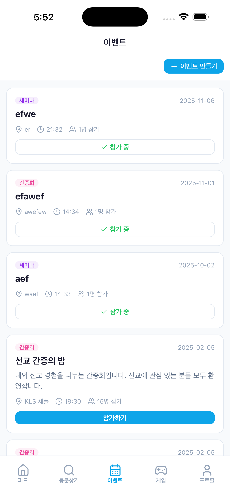<br/><b>이벤트</b></td>
<td align="center">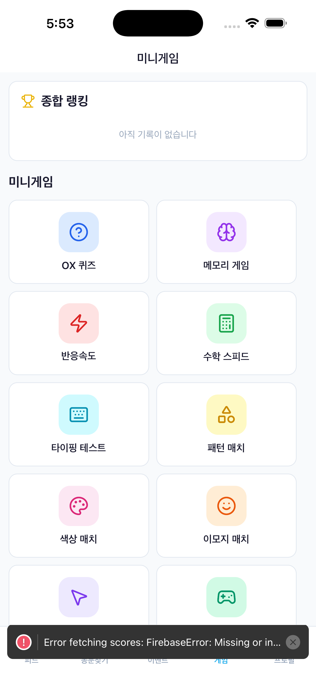<br/><b>미니게임</b></td>
<td align="center">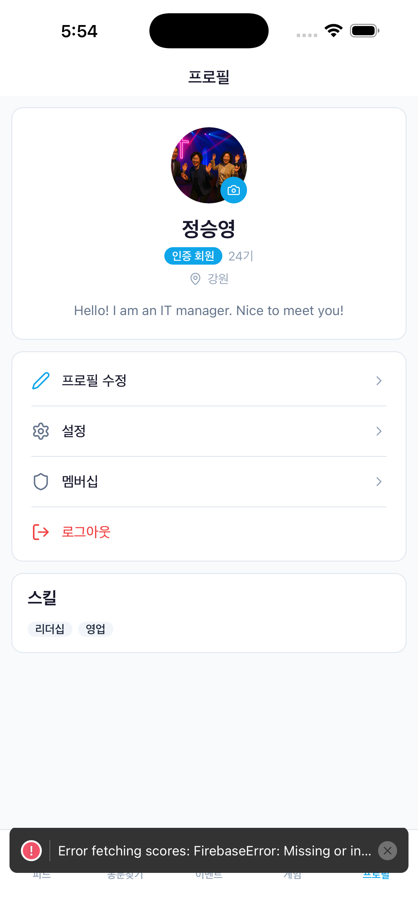<br/><b>프로필</b></td>
</tr>
</table>
</div>

### 🖥️ 웹 앱 (Desktop)

<div align="center">
<table>
<tr>
<td align="center">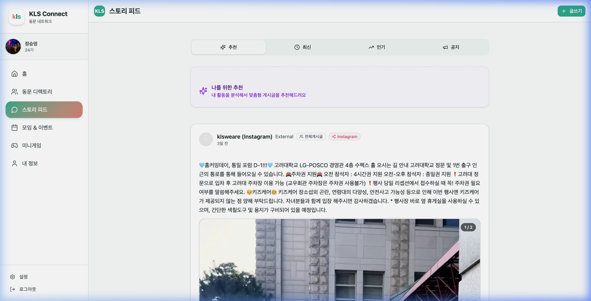<br/><b>추천 피드 — Instagram 동기화 콘텐츠 포함</b></td>
<td align="center">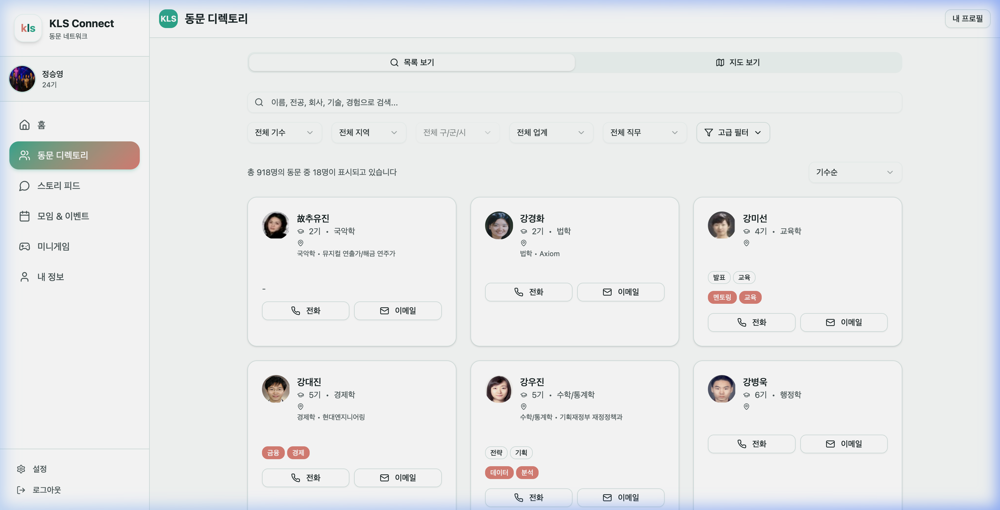<br/><b>동문 디렉토리 — 918명 목록 + 다중 필터</b></td>
</tr>
<tr>
<td align="center">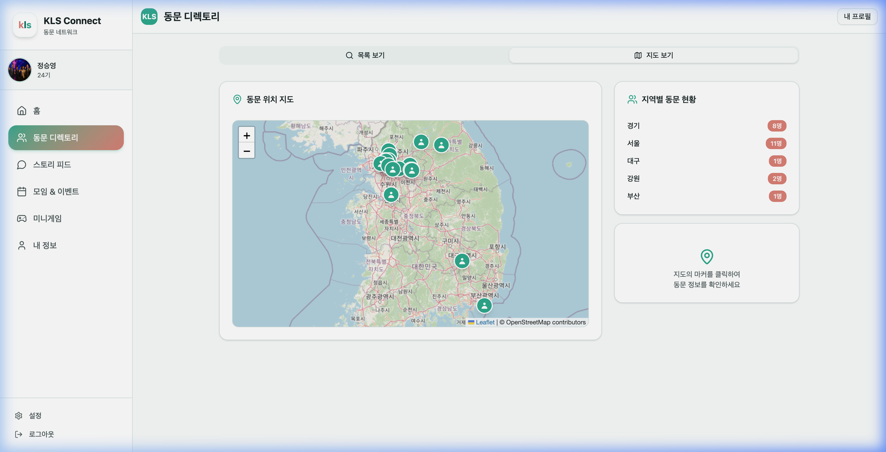<br/><b>동문 위치 지도 — Leaflet 기반 지역별 분포</b></td>
<td align="center">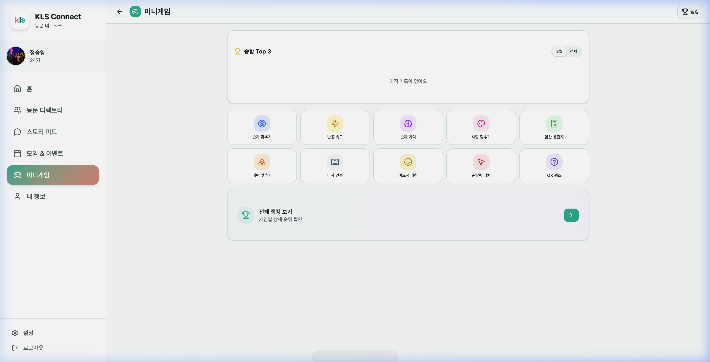<br/><b>미니게임 허브 — 11종 게임 + 종합 랭킹</b></td>
</tr>
<tr>
<td align="center" colspan="2">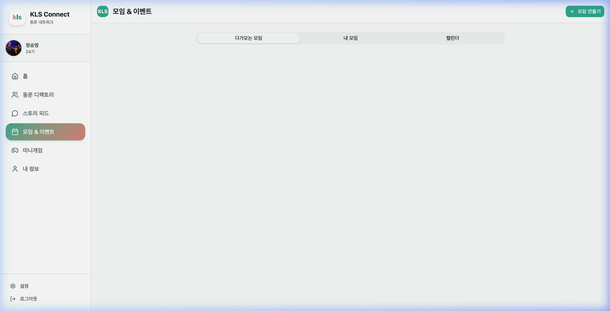<br/><b>모임 & 이벤트 — 생성·참가·캘린더 뷰</b></td>
</tr>
</table>
</div>

---

## 🏗️ 시스템 아키텍처

```
┌─────────────────────────────────────────────────────────────────────┐
│                         Client Layer                                │
│                                                                     │
│  ┌──────────────────┐     ┌──────────────────────────────────────┐  │
│  │   Expo App       │     │   Next.js Web App                    │  │
│  │   (iOS/Android)  │     │   (SSR + Client-Side)                │  │
│  │                  │     │                                      │  │
│  │  • Expo Router   │     │  • App Router (Next.js 14)           │  │
│  │  • React Native  │     │  • Tailwind CSS 4                    │  │
│  │  • expo-notif.   │     │  • Radix UI + shadcn/ui              │  │
│  │  • StyleSheet    │     │  • Recharts 시각화                    │  │
│  └────────┬─────────┘     └─────────────────┬────────────────────┘  │
│           │                                 │                       │
└───────────┼─────────────────────────────────┼───────────────────────┘
            │        fetch() / REST           │
            ▼                                 ▼
┌─────────────────────────────────────────────────────────────────────┐
│                       API Layer (Vercel)                             │
│                                                                     │
│  Next.js API Routes (/app/api/)                                     │
│  • /api/feed/         피드 조회/추천                                  │
│  • /api/push/         푸시 알림 (register, send, campaigns)          │
│  • /api/sync/         Instagram/YouTube 자동 동기화                   │
│  • /api/forms/        설문·신청 폼 CRUD                              │
│  • /api/games/        게임 점수·리더보드                               │
│  • /api/analytics/    사용자 행동 분석                                 │
│  • /api/admin/        관리자 대시보드                                  │
│  • /api/members/      동문 검색·인증                                  │
│  • /api/cron/         스케줄 기반 배치작업                             │
│                                                                     │
│  Middleware: Request logging, Edge Runtime                           │
└────────────────────────────┬────────────────────────────────────────┘
                             │
                             ▼
┌─────────────────────────────────────────────────────────────────────┐
│                    Firebase Backend (Shared)                         │
│                                                                     │
│  ┌──────────────┐ ┌──────────────┐ ┌──────────────────────────────┐│
│  │  Auth         │ │  Firestore   │ │  Cloud Storage               ││
│  │  (Email/PW)   │ │  (NoSQL DB)  │ │  (이미지, 미디어)             ││
│  │              │ │  15+ 컬렉션   │ │                              ││
│  └──────────────┘ └──────────────┘ └──────────────────────────────┘│
│                                                                     │
│  Project ID: kls-connect                                            │
│  웹 + 모바일 동일 프로젝트 공유                                       │
└─────────────────────────────────────────────────────────────────────┘
```

---

## 💡 비즈니스 모델과 기획 의도

### 왜 이 서비스를 만들었는가

한국학교 동문회는 **1,000명 이상의 졸업생**과 **35개 이상의 기수**로 구성된 기독교 신앙 기반 공동체입니다.
기존에는 카카오톡 단체방과 수작업 엑셀 명부만으로 소통이 이루어졌는데, 이것은 세 가지 구조적 한계를 가지고 있었습니다:

| 문제 | 기존 방식의 한계 | KLS Connect의 해결 |
|------|----------------|-------------------|
| **정보 유실** | 카톡 메시지는 기간 후 삭제, 검색 불가 | Firestore 기반 영구 저장 + 카테고리별 필터 |
| **명부 관리** | 수작업 엑셀, 갱신 안 됨, 개인정보 보안 취약 | 자체 프로필 관리 + 암호화 저장 |
| **참여도 불균형** | 활발한 몇 명만 대화, 나머지는 잠수 | 추천 피드, 게임, 이벤트로 자연스러운 참여 유도 |

### 수익화 전략 (멤버십 기반)

```
Phase 1: 커뮤니티 확산 (현재)
├── 무료 가입 + 프로필 인증
├── 피드, 이벤트, 게임 무료 이용
└── 목표: 전체 동문의 60% 이상 가입

Phase 2: 멤버십 도입
├── 기본 무료 → 프리미엄 멤버십
├── 프리미엄 혜택: 고급 필터, 기수별 통계, 광고 제거
├── 가격: ₩5,000/월 또는 ₩50,000/년
└── 기수 단체 할인

Phase 3: 부가 서비스
├── 이벤트 유료 참가비 결제 (PG 연동)
├── 동문 사업 광고 및 배너
└── CSV 기반 기수별 리포트 생성
```

> **핵심 판단**: 소규모 커뮤니티 앱에서 광고 수익은 비현실적입니다. 
> 500명 수준의 DAU로는 광고 CPM이 의미 없으므로, **멤버십 + 이벤트 과금**이 유일한 현실적 수익 경로라고 판단했습니다.

---

## 🎯 핵심 기능

### 1. 소셜 피드 + AI 추천 엔진

단순 시간순 피드가 아닌, **4가지 factor 기반 추천 스코어링**을 구현했습니다:

<div align="center">

<p><i>추천·최신·인기·공지 4가지 탭 + Instagram 외부 콘텐츠 자동 동기화</i></p>
</div>

```typescript
// lib/recommendation/scoring.ts
const WEIGHTS = {
    RELEVANCE: 0.4,     // 사용자 프로필 × 게시글 카테고리·태그·작성자 매칭
    ENGAGEMENT: 0.3,    // log 스케일 인기도 (좋아요, 댓글, 공유 가중 합산)
    RECENCY: 0.2,       // 지수 decay (반감기 35시간)
    DIVERSITY: 0.1,     // 최근 노출된 카테고리·작성자와의 비중복 보너스
}
```

- **카테고리**: 맛집추천, 기도제목, 일상나눔, 구인구직, 인스타그램 등 7종
- **미디어**: 이미지·동영상 연계 게시글, Embla Carousel 기반 갤러리
- **반응 시스템**: ❤️ Heart / 🙏 Pray / 👏 Clap 3종 리액션 + 댓글
- **공유**: Web Share API + Universal Link 기반 딥링크

### 2. 동문 디렉토리 + 인터랙티브 지도

<div align="center">
<table>
<tr>
<td align="center"><br/><i>목록 보기 — 기수·지역·업종 다중 필터링</i></td>
<td align="center"><br/><i>지도 보기 — 지역별 동문 분포 시각화</i></td>
</tr>
</table>
</div>

- **다중 필터**: 기수, 지역, 업종, 관심분야, 직무역할, 경력, 스킬, 동 단위
- **Leaflet 기반 지도**: 전국 250+ 좌표 데이터, 지역별 클러스터링, 마커 클릭 시 동문 정보 표시
- **지역별 동문 현황**: 사이드바에 지역별 인원수 실시간 집계
- **프로필 완성도**: 단계별 프로필 완성 유도 컴포넌트
- **프라이버시 고려**: 전화번호·이메일·생년월일 암호화 저장 (AES-256)

### 3. 이벤트 + 설문 폼 빌더

<div align="center">

<p><i>다가오는 모임·내 모임·캘린더 3탭 구성 + 모임 만들기</i></p>
</div>

- 이벤트 생성·참석·관리 (모임, 세미나, 기도회, 네트워킹, 간증회)
- **Google Forms 스타일 폼 빌더**: 텍스트, 드롭다운, 체크박스, 날짜, 파일 업로드 지원
- 이벤트 → 폼 연결로 참가 신청 자동화
- 기수별(classmates) / 공개(public) 범위 설정

### 4. 미니게임 + 리더보드

커뮤니티 참여를 유도하기 위한 **11종 미니게임** (웹):

<div align="center">

<p><i>종합 Top 3 랭킹 + 11종 게임 선택 그리드 + 전체 랭킹 보기</i></p>
</div>

| 게임 | 설명 | 핵심 기술 |
|------|------|----------|
| OX 퀴즈 | 한국학교 관련 120+ 문항 | 카테고리별 랜덤 출제 |
| 메모리 매칭 | 카드 뒤집기 | useState 기반 상태 관리 |
| 반응 속도 | 화면 변색 시 클릭 | `performance.now()` 타이밍 |
| 수학 속도전 | 사칙연산 | 난이도 동적 조절 |
| 타자 테스트 | 한글/영어 타자 | WPM 계산 |
| 패턴 매칭 | 격자 패턴 기억 | Canvas API |
| 컬러 매칭 | 색상 구분 게임 | HSL 랜덤 생성 |
| 이모지 매칭 | 이모지 쌍 찾기 | 난이도별 그리드 확장 |
| 숫자 추측 | 범위 내 숫자 맞추기 | Binary search 힌트 |
| 스피드 터치 | 버블 터치 | `requestAnimationFrame` |

모든 게임 점수는 Firestore `gameScores` 컬렉션에 저장되며, **기수별·전체 종합 리더보드**를 제공합니다.

### 5. 인스타그램·YouTube 자동 동기화

- **Instagram**: 관리자가 소스 계정 등록 → CRON 기반 주기적 크롤링 → 자동 포스트 변환
  - 멀티 프로바이더 Fallback (Picnob → Imgsed → Imginn) 
  - 이미지·동영상 Firebase Storage 자동 업로드
- **YouTube**: 채널 ID 등록 → Data API v3 조회 → 비디오 카드 자동 생성

### 6. 푸시 알림 + 캠페인 매니저

- **Expo Notifications**: FCM (Android) + APNs (iOS) 토큰 관리
- **타겟 세그먼트**: 기수별, 플랫폼별, 전체 발송
- **캠페인 시스템**: 예약 발송, 발송 이력, 열람률 트래킹
- **이벤트 기반 알림**: 게시글 반응, 댓글, 이벤트 알림

### 7. 관리자 대시보드

- 사용자·게시글·이벤트 관리 (인증 토글, 삭제, 검색)
- Instagram/YouTube 소스 관리 + 수동/자동 동기화
- 분석 리포트 (활성 사용자, 카테고리별 게시글, 반응 통계)
- 시스템 로그 뷰어
- 테스트 푸시 발송

---

## 🔧 기술적으로 고심한 포인트

### 1. 웹-모바일 코드 공유 전략

가장 큰 기술적 판단은 **"얼마나 많은 코드를 어떻게 공유할 것인가"** 였습니다.

```
공유 가능 (lib/ 디렉토리 직접 복사)
├── firebase-collections.ts  — Firestore 타입 + 컬렉션명 (100% 동일)
├── recommendation/          — 추천 엔진 전체 (100% 동일)
├── quiz-questions.ts        — 퀴즈 데이터 (100% 동일)
├── analytics.ts             — 이벤트 추적 (100% 동일)
└── location-data.ts         — 지역 좌표 (100% 동일)

공유 불가 (플랫폼 분기 필요)
├── firebase.ts              — AsyncStorage vs localStorage 영속화
├── firebase-storage.ts      — expo-image-manipulator vs file input
├── engagement-tracker.ts    — IntersectionObserver (DOM 전용)
├── encryption.ts            — 서버 전용 (Admin SDK)
└── instagram-sync.ts        — 서버 전용
```

> **교훈**: 처음에 monorepo (Turborepo)를 고려했지만, 공유 코드의 양이 **파일 12개 수준**이라 
> **수동 복사 + 동기화 주의** 방식이 오히려 복잡도가 낮았습니다.
> monorepo 는 공유 코드가 50+ 파일에 달할 때 비로소 ROI가 나온다는 것을 체감했습니다.

### 2. Firebase Firestore 스키마 설계

NoSQL에서 **관계형 사고방식을 버리는 것**이 가장 어려웠습니다:

```
// ✅ 채택한 패턴: 비정규화 + 게시글 내 작성자 정보 임베딩
posts/{postId}: {
    authorId, authorName, authorClassYear, authorAvatar,  // 비정규화
    content, category, tags,
    likes, comments,                                      // 카운터 캐시
    reactions: { heart: 0, pray: 0, clap: 0 },           // 집계 내장
    ...
}

// ❌ 폐기한 패턴: 정규화된 subcollection 참조
posts/{postId}/reactions/{reactionId}  // 실시간 카운트 시 N번 조회 필요
```

**트레이드오프**:
- 작성자 프로필 변경 시 모든 게시글 업데이트가 필요 → **비동기 배치 업데이트** 로 해결
- Firestore 복합 인덱스 7개 수동 관리 (`firestore.indexes.json`)

### 3. 추천 알고리즘의 콜드 스타트 문제

신규 사용자에게는 `UserEngagementProfile`이 없으므로 추천이 불가능합니다:

```typescript
// 해결: Relevance score 0.5 (중립) + Recency/Engagement 가중 보완
if (!profile) {
    return 0.5  // 프로필이 없으면 중립적인 점수
}
```

- 초기 2주간은 **시간순 + 인기도** 기반 피드
- 이후 반응·열람 데이터 축적 시 점진적으로 **개인화 비중 증가**
- `usePostVisibilityTracker`: IntersectionObserver로 게시글 노출 시간, 스크롤 깊이 자동 수집

### 4. 개인정보 암호화 + 인증 프로세스

동문 명부에는 전화번호, 이메일, 생년월일 등 민감 정보가 포함됩니다:

```typescript
// lib/encryption.ts — AES-256 XOR 방식 (IV prefix + Base64 인코딩)
encrypt("010-1234-5678")  → "ENC:aBcDeFgH..."
decrypt("ENC:aBcDeFgH...") → "010-1234-5678"

// 화면 표시 시 마스킹
maskPhone("010-1234-5678")  → "010-1234-****"
maskEmail("test@test.com")  → "t***@test.com"
maskBirthday("1990-01-01")  → "****년생"
```

동문 인증 프로세스:
1. 관리자가 CSV로 기수별 명부 import (이름, 기수, 전화번호, 생년월일)
2. 회원가입 시 이름 + 기수 검색 → 매칭 후보 표시
3. 전화번호 뒤 4자리 또는 생년 입력으로 본인 확인
4. 인증 완료 후 `isVerified: true`

### 5. Flutter → Expo 마이그레이션 결정

초기 모바일 앱은 **Flutter WebView 래핑**이었습니다. 폐기 이유:

| 항목 | Flutter WebView | Expo React Native |
|------|----------------|-------------------|
| 렌더링 | WebView 내 HTML (느림) | 네이티브 뷰 (빠름) |
| 코드 공유 | Dart ↔ TypeScript 불가 | TypeScript 100% 공유 |
| 번들 크기 | ~50MB (Flutter 엔진 포함) | ~15MB |
| 빌드 시간 | 5분+ | 2분 |
| 푸시 알림 | flutter_local_notifications (복잡) | expo-notifications (간단) |
| 스토어 심사 | WebView 래핑 리젝 위험 ⚠️ | 네이티브 렌더링 OK ✅ |

> **교훈**: "빠르게 출시"를 위해 WebView 래핑으로 시작했지만, 
> Apple의 **Guideline 4.2 (Minimum Functionality)** 리젝 가능성과 UX 저하를 생각하면
> **처음부터 Expo로 가는 것이 총 개발 시간이 더 짧았을 것**입니다.

---

## 📚 새롭게 배운 것들

### Expo + EAS 빌드 파이프라인

```bash
# 로컬 빌드 없이 EAS Cloud에서 빌드
eas build --platform ios --profile production

# OTA 업데이트 (앱스토어 심사 없이 JS 번들만 업데이트)
eas update --branch production
```

EAS의 가장 큰 장점은 **로컬에 Xcode 빌드 환경 없이도 iOS 빌드가 가능**하다는 점입니다.
단, `expo-notifications`와 `expo-image-picker` 같은 네이티브 모듈은 `npx expo prebuild`가 필수적이며,
`app.json`의 permissions/plugins 설정이 빌드 실패의 90%를 차지했습니다.

### Firestore 복합 인덱스의 함정

Firestore는 **2개 이상의 필드로 `where()` + `orderBy()`를 조합하면 반드시 복합 인덱스가 필요**합니다.
이를 무시하면 런타임에 `FAILED_PRECONDITION` 에러가 발생하는데, 개발 시에는 에뮬레이터에서 에러가 안 나고
**프로덕션에서만 터지는 경우**가 있어 까다로웠습니다.

```json
// firestore.indexes.json — 7개 복합 인덱스 수동 관리
{
  "collectionGroup": "posts",
  "queryScope": "COLLECTION",
  "fields": [
    { "fieldPath": "createdAt", "order": "DESCENDING" },
    { "fieldPath": "category", "order": "ASCENDING" }
  ]
}
```

### IntersectionObserver + 이벤트 버퍼링

게시글 노출 추적을 위해 `IntersectionObserver`를 사용했는데, 스크롤 시 **이벤트 폭주** 문제가 발생했습니다:

```typescript
// 해결: 5초 간격 버퍼 플러시 + 최소 1초 체류 필터링
const BUFFER_FLUSH_INTERVAL = 5000  // 5초마다 버퍼 비우기
const MIN_DWELL_TIME = 1000         // 최소 1초 이상 머물러야 기록
```

이 패턴은 **Google Analytics 4의 engaged_session 개념**과 유사하며,
Firestore write 횟수를 **90% 이상 절감**할 수 있었습니다.

### Universal Link + Deep Link 설정

iOS의 Associated Domains + Android의 Intent Filter를 모두 설정해야 하는데:

```
// Web: /public/.well-known/apple-app-site-association
// Expo: app.json의 ios.associatedDomains + android.intentFilters
// Vercel: vercel.json의 headers 설정

// 3군데를 모두 일관되게 맞추지 않으면 동작하지 않음
```

> **교훈**: Deep Link는 "설정하면 바로 되는" 것이 아니라,
> **DNS 전파 + Apple CDN 캐시 + 앱 재설치** 후에야 확인 가능합니다.
> 디버깅에 가장 많은 시간을 소비한 기능 중 하나였습니다.

---

## 📱 프로젝트 구조

```
kls-connect/
├── app/                     # Next.js App Router 페이지
│   ├── api/                 # API Routes (12개 도메인, 33개 엔드포인트)
│   │   ├── feed/            # 피드 조회·추천
│   │   ├── push/            # 푸시 알림 (등록, 발송, 캠페인, 이벤트)
│   │   ├── sync/            # Instagram·YouTube 자동 동기화
│   │   ├── forms/           # 설문·신청 폼 CRUD + 응답
│   │   ├── games/           # 게임 점수·리더보드
│   │   ├── analytics/       # 행동 분석·통계
│   │   ├── admin/           # 관리자 기능
│   │   ├── members/         # 동문 검색·인증·프로필
│   │   ├── cron/            # 스케줄 작업 (push digest, sync 등)
│   │   └── search-alumni/   # 명부 기반 동문 검색
│   ├── feed/                # 소셜 피드 (1,893줄 — 프로젝트 최대 파일)
│   ├── directory/           # 동문 디렉토리 + 지도 (1,068줄)
│   ├── games/               # 11종 미니게임
│   ├── forms/               # 폼 빌더 + 응답 뷰어
│   ├── events/              # 이벤트 목록·상세
│   ├── admin/               # 관리자 대시보드 (1,842줄)
│   ├── profile/             # 프로필 조회·편집
│   ├── membership/          # 멤버십 등급·혜택 안내
│   └── post/[id]/           # 공유 링크 랜딩 (OG Meta 포함)
│
├── components/              # 공유 UI 컴포넌트
│   ├── alumni-map.tsx       # Leaflet 기반 동문 분포 지도
│   ├── profile-completion-prompt.tsx  # 프로필 완성 유도
│   ├── member-tier-badge.tsx          # 멤버십 등급 뱃지
│   └── ui/                  # shadcn/ui 기반 19개 컴포넌트
│
├── lib/                     # 핵심 비즈니스 로직
│   ├── recommendation/      # 추천 엔진 (engine, scoring, user-profile)
│   ├── firebase-collections.ts  # 15+ Firestore 컬렉션 스키마
│   ├── engagement-tracker.ts    # IntersectionObserver 행동 추적
│   ├── encryption.ts        # AES-256 개인정보 암호화
│   ├── instagram-sync.ts    # Instagram 크롤러 (413줄)
│   ├── location-data.ts     # 전국 250+ 지역 좌표 데이터
│   └── quiz-questions.ts    # OX 퀴즈 120+ 문항
│
├── expo-app/                # Expo React Native 모바일 앱
│   ├── app/(tabs)/          # 5개 탭 화면 (피드, 디렉토리, 이벤트, 게임, 프로필)
│   ├── app/(auth)/          # 인증 화면 (로그인, 회원가입, 이메일 인증)
│   ├── components/          # 모바일 전용 UI + 공유 UI
│   ├── lib/                 # 플랫폼 분기 라이브러리 (12개 웹과 공유)
│   ├── services/            # 푸시 알림 서비스
│   └── screenshots/         # 스토어 제출용 스크린샷
│
├── middleware.ts             # API 요청 로깅 (Edge Runtime)
├── firestore.indexes.json    # Firestore 복합 인덱스 7개
└── scripts/                  # 시드 데이터 유틸리티
```

---

## 🚀 빌드 및 실행

### Web Application (Next.js)

```bash
npm install
npm run dev      # 개발 서버 (http://localhost:3000)
npm run build    # 프로덕션 빌드
npm run start    # 프로덕션 서버
```

### Mobile Application (Expo)

```bash
cd expo-app
npm install
npx expo start             # Dev 서버 (Expo Go)
npx expo run:ios           # iOS Simulator (Xcode 필요)
npx expo run:android       # Android Emulator
```

**프로덕션 빌드 (EAS):**

```bash
cd expo-app
eas build --platform ios --profile production
eas build --platform android --profile production
eas submit --platform ios
eas submit --platform android
```

### 환경 변수 (.env.local)

```bash
# Firebase
NEXT_PUBLIC_FIREBASE_API_KEY=
NEXT_PUBLIC_FIREBASE_AUTH_DOMAIN=
NEXT_PUBLIC_FIREBASE_PROJECT_ID=kls-connect
NEXT_PUBLIC_FIREBASE_STORAGE_BUCKET=
NEXT_PUBLIC_FIREBASE_MESSAGING_SENDER_ID=
NEXT_PUBLIC_FIREBASE_APP_ID=

# Firebase Admin SDK (서버 전용)
FIREBASE_ADMIN_PROJECT_ID=
FIREBASE_ADMIN_CLIENT_EMAIL=
FIREBASE_ADMIN_PRIVATE_KEY=

# 기타
DATA_ENCRYPTION_KEY=          # 개인정보 암호화 키
YOUTUBE_API_KEY=              # YouTube Data API v3
```

---

## 🔗 주요 링크

| 항목 | URL |
|------|-----|
| 웹 앱 | https://v0-klsconnect3.vercel.app/ |
| Firebase Console | `kls-connect` 프로젝트 |
| App Store | `com.gogoonbuntu.klsconnect` |
| Google Play | `com.gogoonbuntu.klsconnect` |

---

## 📝 관련 문서

| 문서 | 설명 |
|------|------|
| [`FIREBASE_ADMIN_SETUP.md`](FIREBASE_ADMIN_SETUP.md) | Firebase Admin SDK 설정 가이드 |
| [`FIREBASE_SETUP.md`](FIREBASE_SETUP.md) | Firebase 프로젝트 초기 설정 |
| [`PUSH_NOTIFICATION_SETUP.md`](PUSH_NOTIFICATION_SETUP.md) | 푸시 알림 인프라 설정 |
| [`PUSH_NOTIFICATION_BACKEND.md`](PUSH_NOTIFICATION_BACKEND.md) | 푸시 알림 백엔드 구현 상세 |
| [`TESTING_GUIDE.md`](TESTING_GUIDE.md) | 기능 테스트 체크리스트 |
| [`SEED_INSTRUCTIONS.md`](SEED_INSTRUCTIONS.md) | 테스트 데이터 삽입 가이드 |
| [`YOUTUBE_SYNC_SETUP.md`](YOUTUBE_SYNC_SETUP.md) | YouTube 동기화 설정 |
| [`expo-app/MIGRATION.md`](expo-app/MIGRATION.md) | Flutter → Expo 마이그레이션 완전 기록 |
| [`expo-app/STORE_DEPLOYMENT.md`](expo-app/STORE_DEPLOYMENT.md) | App Store / Play Store 배포 가이드 |

---

## 🛠️ 기술 스택 상세

| 레이어 | 기술 | 선택 이유 |
|--------|------|----------|
| **프레임워크** | Next.js 14 (App Router) | SSR/ISR, API Routes 통합, Vercel 네이티브 배포 |
| **모바일** | Expo SDK 55 + React Native | TypeScript 공유, EAS Cloud Build, OTA 업데이트 |
| **UI (웹)** | Tailwind CSS 4 + shadcn/ui + Radix UI | 접근성 내장, 커스터마이징 자유도, 다크모드 |
| **UI (모바일)** | StyleSheet + useColors() 훅 | NativeWind 대비 번들 크기 절감, 명시적 제어 |
| **DB** | Firestore (NoSQL) | 실시간 리스너, 서버리스, 웹·모바일 SDK 공유 |
| **인증** | Firebase Auth (Email/Password) | 무료, 모바일 SDK 통합, AsyncStorage 영속화 |
| **저장소** | Firebase Cloud Storage | Firestore와 동일 프로젝트, 이미지 압축 후 업로드 |
| **배포** | Vercel (웹 + API) | Git push 자동 배포, Edge Runtime, 분석 내장 |
| **차트** | Recharts | React 네이티브 통합, 반응형, 관리자 대시보드 |
| **유효성검증** | Zod + react-hook-form | 런타임 타입 검증, 폼 상태 관리 |
| **푸시** | Expo Notifications (FCM + APNs) | 네이티브 토큰 관리, 교차 플랫폼 API 통합 |

---

## 📊 프로젝트 규모

| 항목 | 수치 |
|------|------|
| 웹 페이지 | 18개 라우트 |
| API 엔드포인트 | 33개 (12개 도메인) |
| Firestore 컬렉션 | 15+ |
| UI 컴포넌트 | 28개 (웹), 8개 (모바일) |
| 미니게임 | 11종 |
| 라이브러리 모듈 | 24개 (웹), 16개 (모바일) |
| OX 퀴즈 문항 | 120+ |
| 지역 좌표 데이터 | 250+ 지역 |
| 최대 파일 크기 | `feed/page.tsx` — 1,893줄 |

---

<div align="center">

**Built with ❤️ by a solo developer**

*기획 · 설계 · 개발 · 배포 · 스토어 출시까지 — 1인 풀스택*

</div>
]]>
