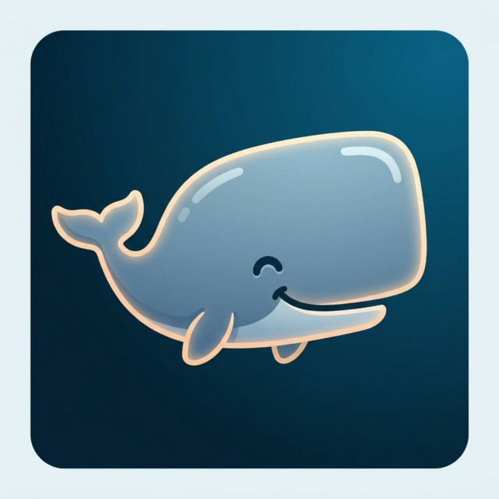
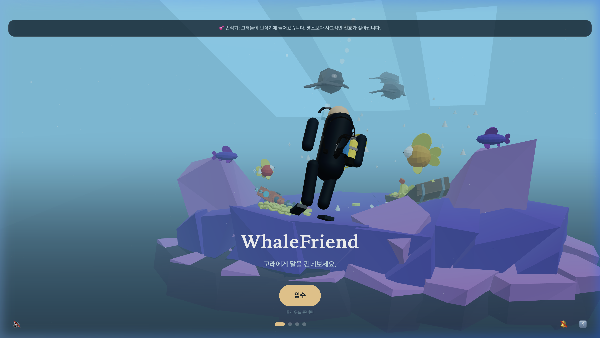
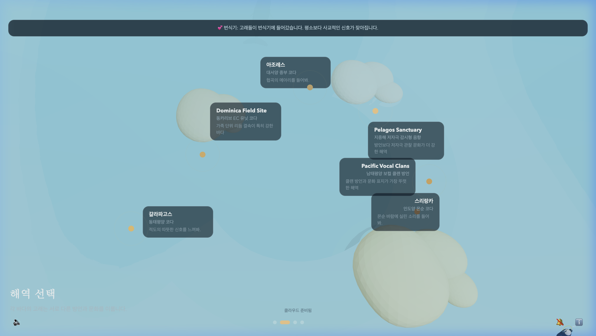
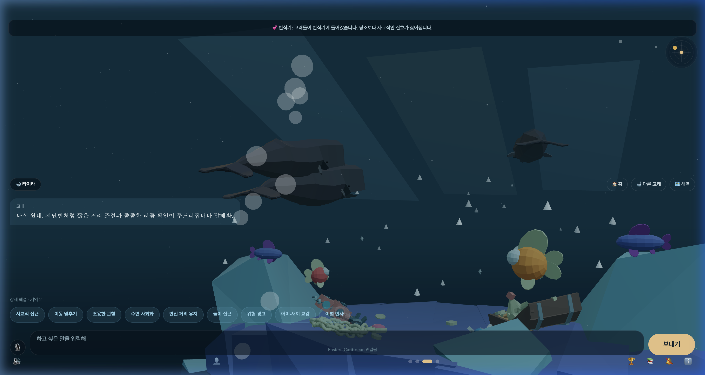
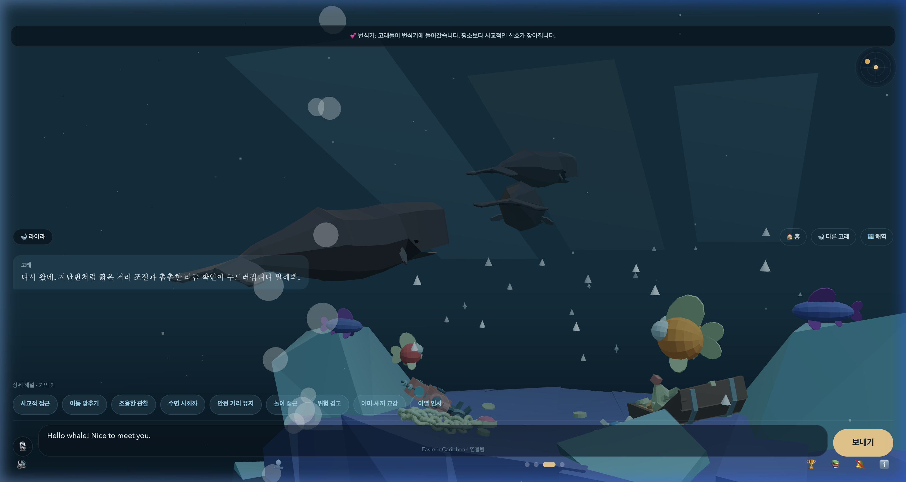

<p align="center">
  
</p>

<h1 align="center">WhaleFriend 🐋</h1>

<p align="center">
  <strong>향유고래 연구 기반 소통 시뮬레이션 웹앱</strong><br/>
  <em>Research-inspired sperm whale conversation simulator</em>
</p>

<p align="center">
  <a href="https://whalefriend.vercel.app">🌊 지금 바로 입수하기</a> · 
  <a href="docs/scientific-basis.md">📄 과학적 근거 문서</a> · 
  <a href="docs/privacy-policy.md">🔒 개인정보 처리방침</a>
</p>

---

## 🐳 어떤 서비스인가요?

WhaleFriend는 **바다에 잠수해서 향유고래에게 직접 말을 걸어보는 몰입형 웹앱**입니다.

"안녕, 나도 조용히 함께 있고 싶어." — 이 한마디를 고래에게 건네면, 고래는 자신의 방언과 리듬으로 코다 신호를 돌려보냅니다. 단순한 챗봇이 아니라, **실제 논문에서 밝혀진 향유고래의 소통 구조를 기반으로** 리듬, 템포, 루바토, 장식음이 조합된 신호를 생성하고 해석해주는 시뮬레이터입니다.

> **⚠️ WhaleFriend는 "실제 고래어 번역기"가 아닙니다.**  
> 공개된 1차 논문의 구조적 발견과 행동 문맥을 결합한 시뮬레이션이며,  
> 문장 수준의 의미 해석은 추론 단계입니다. 이 선을 지키는 것이 과학적으로 가장 정직한 설계입니다.

---

## 📸 스크린샷

<table>
  <tr>
    <td align="center"><br/><sub><b>입수 — 3D 수중 씬</b></sub></td>
    <td align="center"><br/><sub><b>해역 선택 — 6개 해역 지도</b></sub></td>
  </tr>
  <tr>
    <td align="center"><br/><sub><b>3인칭 시점 — 다이버 뒤에서</b></sub></td>
    <td align="center"><br/><sub><b>대화 UI — 코다 시각화 + 울음소리</b></sub></td>
  </tr>
</table>

---

## ✨ 서비스의 매력 포인트

### 🎭 고래마다 성격이 다르다
도미니카의 **라이라**는 부드럽게 간격을 맞추며 상대의 박자를 확인하고, 스리랑카의 **문순**은 계절풍과 함께 이동하는 명상적인 연장자입니다. 6개 해역 × 3마리씩, **총 18마리**의 고래 개체가 각자의 성격·역할·방언으로 대화합니다.

### 🌊 바다마다 문화가 다르다
도미니카, 남태평양, 지중해, 아조레스, 갈라파고스, 스리랑카 — 해역마다 고유한 **방언 모드**가 존재합니다. 같은 "안녕"이라도 도미니카에서는 "짧은 클릭 묶음으로 존재를 확인"하고, 지중해에서는 "간격을 늘리지 않고 짧게 끊어 존재만 남깁니다."

### 💕 고래가 나를 기억한다
같은 해역에 다시 돌아오면 고래가 이전 접촉을 기억합니다. 관계 단계(`첫 접촉` → `반복 방문자` → `인식된 존재` → `신뢰 관계`)가 쌓이며, 기억에 따라 응답 톤이 달라집니다.

### 🎵 과학적 울음소리 합성
Web Audio API로 합성된 **5가지 향유고래 발성 유형**이 상황에 맞게 재생됩니다:

| 발성 유형 | 상황 | 과학적 근거 |
|-----------|------|------------|
| **코다 (Coda)** | 인사, 이별, 사회적 교류 | Rendell & Whitehead 2003 |
| **일반 클릭 (Usual Click)** | 조용한 관찰 | Watwood et al. 2006 |
| **크릭 (Creak)** | 흥분, 위험 경고 | Madsen et al. 2002 |
| **느린 클릭 (Slow Click)** | 성체 수컷 전용 | Weilgart & Whitehead 1988 |
| **트럼펫 (Trumpet)** | 특별 이벤트 | Teloni et al. 2005 |

각 개체의 체장에 비례해 공명 주파수가 달라져, **같은 코다라도 고래마다 다른 소리**가 납니다.

### 📖 3D 고래 도서관
Three.js로 구현된 3D 도서관에서 실제 논문 기반의 연구 카드를 탐색할 수 있습니다. 코다의 조합 문법, 클랜의 문화적 분화, 이동 예측 모델 등 6개의 큐레이션된 연구 스토리를 읽어보세요.

### 🎥 3인칭 수중 카메라
다이버의 뒤통수가 시야에 들어오는 3인칭 시점에서, 카메라가 **활성 대화 고래를 실시간 추적**합니다. "다른 고래"를 선택하면 카메라가 부드럽게 새 고래로 팬합니다.

### 🔐 Google 로그인 + 클라우드 동기화
Google 계정으로 로그인하면 업적, 대화 기록, 고래 기억이 **Firebase Firestore에 자동 동기화**됩니다. 어디서든 이어서 플레이할 수 있습니다.

---

## 🔬 과학적 근거

WhaleFriend의 모든 시뮬레이션은 **공개된 1차 논문**에서 출발합니다.

### 핵심 구조: 코다의 4가지 축

[Nature Communications 2024](https://www.nature.com/articles/s41467-024-47221-8)에 따르면, 향유고래의 코다는 **네 가지 독립적인 축**으로 조합됩니다:

| 축 | 설명 | 앱에서의 구현 |
|---|---|---|
| **Rhythm** | 클릭 간격의 기본 패턴 | 시그널 카드의 리듬 시각화 |
| **Tempo** | 전체 속도 변화 | ICI 간격 수치로 표현 |
| **Rubato** | 미세한 타이밍 흔들림 | 코다 재생 시 자연스러운 변주 |
| **Ornamentation** | 추가 클릭과 장식음 | 장식음 포함 여부 표시 |

### 문화적 분화: 클랜과 방언

| 근거 논문 | 핵심 발견 | 앱 적용 |
|---|---|---|
| [PNAS 2022](https://doi.org/10.1073/pnas.2201692119) | 태평양 23곳에서 보컬 클랜 구분 | 해역별 방언 모드 |
| [eLife 2025](https://elifesciences.org/reviewed-preprints/96362) | 클랜 경계를 넘는 사회 학습 | 지역 간 공통 코다 존재 |
| [SR 2025-movement](https://www.nature.com/articles/s41598-025-23733-1) | 사회 단위 이동 예측 | 응답의 접근 조건과 거리 제안 |

### 의도적으로 하지 않은 것

- ❌ 실제 고래 의미를 문장 단위로 "번역했다"고 주장하지 않음
- ❌ 야생 개체에 대한 플레이백 실험 자동화 제공하지 않음
- ❌ 감정 해석을 확정 사실처럼 표현하지 않음

> 📄 전체 논문 분석과 해석 원칙은 [docs/scientific-basis.md](docs/scientific-basis.md)에서 확인할 수 있습니다.

---

## 🎮 어떻게 즐기나요?

### 1단계: 입수 🤿
3D 수중 장면에서 스쿠버 다이버와 함께 바닷속으로 입수합니다.

### 2단계: 해역 선택 🗺️
6개 해역 중 하나를 선택합니다. 각 해역마다 고유한 방언, 문화, 고래 개체가 기다립니다.

### 3단계: 대화 💬
텍스트로 말을 건네면 AI가 의도를 분석하고, 해당 해역의 방언으로 코다 신호를 생성합니다. 음성 입력(한국어)도 지원합니다.

### 4단계: 해석 읽기 🔍
고래의 응답 버블을 탭하면 **상세 해설**을 볼 수 있습니다:
- 어떤 의도로 해석되었는지
- 어떤 코다 구조가 생성되었는지
- 어떤 논문 근거에 기반한 것인지

### 5단계: 공유 📱
대화 결과를 공유 카드로 만들어 SNS에 공유할 수 있습니다.

### 보너스: 고래가 먼저 말을 건넵니다 🔔
웹 푸시 알림을 켜면, 고래가 먼저 당신을 부릅니다. *"다시 오려면 먼저 속도를 낮춰 줘."*

---

## 🛠️ 기술 하이라이트

### 아키텍처

```
App.tsx (~200 lines, slim orchestrator)
├── AppContext.tsx (중앙 상태 관리, ~700 lines)
├── ImmersiveScene.web.tsx (Three.js 3D 수중 장면, ~1,400 lines)
├── 4 Slide Components (Intro / Map / Encounter / Library)
├── 6 Feature Components (CodaVisualizer / QuickReplyChips / VoiceInput / ShareCard / TypingEffect / OnboardingOverlay)
├── 2 Modal Components (AnalysisModal / InfoModal)
└── Data Layer (regions / species / seasons / library / coda / whale-memory)
```

### 기술 스택

| 레이어 | 기술 | 용도 |
|---|---|---|
| **프레임워크** | Expo + React Native Web | 크로스플랫폼 (Web / iOS / Android) |
| **3D** | Three.js + @react-three/fiber | 수중 장면, 고래 모델, 도서관 공간 |
| **오디오** | Web Audio API | 코다 클릭 시퀀스 합성 및 재생 |
| **AI** | Gemini API + Groq API | 대화 의도 분석 및 응답 생성 |
| **DB** | Firebase Firestore | 시뮬레이션 로그 저장 및 구독 |
| **배포** | Vercel (정적 + Serverless) | 웹 앱 호스팅, API 라우트, Cron |
| **푸시** | Web Push API + VAPID | 고래가 먼저 말을 거는 알림 |
| **음성** | Web Speech API | 한국어 음성 입력 |
| **PWA** | Web App Manifest | 홈 화면 설치 지원 |

### 데이터 구조의 깊이

- **6개 해역** — 각각 고유한 방언(리듬 태그, 클릭 오프셋, 템포 시프트), 색상 팔레트, 연구 출처
- **9개 대화 의도** — 인사, 정렬, 관찰, 수면, 경계, 놀이, 위험, 양육, 이별
- **18마리 고래 개체** — 이름, 역할, 성격, 방언 훅, 선호 의도, 레이더 위치, 음향 프로필
- **18개 과학적 관측 기록** — 체장, 체중, 잠수 행동, 사회적 행동, 식별 특징 (whale-observation.ts)
- **개체별 음성 프로필** — 체장 기반 공명 주파수, 연령별 포먼트 특성
- **54개 고유 응답 쌍** — 6해역 × 9의도, 모두 해역 문화에 맞게 작성
- **4개 계절 이벤트** — 번식기, 먹이활동기, 이동기, 기본 (의도 가중치 자동 변경)

### 코다 시그널 엔진

```typescript
// 실제 논문의 4축 구조를 직접 모델링
interface CodaSignal {
  intervals: number[];        // 클릭 간 간격 (ms)
  baseICI: number;            // 기본 Inter-Click Interval
  tempo: number;              // 템포 계수
  hasOrnament: boolean;       // 장식음 여부
  rhythmTag: string;          // 리듬 분류 태그
  spectralHue: string;        // 스펙트럼 색조
}
```

---

## 🚀 시작하기

### 요구사항
- Node.js 18+
- npm 9+

### 설치 및 실행

```bash
git clone https://github.com/gogoonbuntu/whalefriend.git
cd whalefriend
npm install
cp .env.example .env    # 환경 변수 편집
npm run web             # 로컬 개발 서버 시작
```

> Firebase를 연결하지 않아도 앱은 **로컬 시뮬레이션 모드**로 동작합니다.

### 환경 변수

```bash
# 클라이언트 (Expo Public)
EXPO_PUBLIC_FIREBASE_API_KEY=
EXPO_PUBLIC_FIREBASE_AUTH_DOMAIN=
EXPO_PUBLIC_FIREBASE_PROJECT_ID=
EXPO_PUBLIC_FIREBASE_STORAGE_BUCKET=
EXPO_PUBLIC_FIREBASE_MESSAGING_SENDER_ID=
EXPO_PUBLIC_FIREBASE_APP_ID=
EXPO_PUBLIC_VAPID_PUBLIC_KEY=

# 서버 전용
GEMINI_API_KEY=
GROQ_API_KEY=
VAPID_PRIVATE_KEY=
VAPID_SUBJECT=mailto:hello@example.com
CRON_SECRET=
```

---

## 📦 배포

### Vercel (웹)

```bash
vercel --prod
```

설정: [`vercel.json`](vercel.json)
- Build: `npm run build:web` (Expo web export)
- Output: `dist/`
- Cron: `/api/cron-whale-nudge` — 매일 09:00 UTC에 활성 구독자에게 고래 메시지 전송

### 모바일 (Expo / EAS)

- Expo 설정: [`app.json`](app.json)
- EAS 프로필: [`eas.json`](eas.json)
- 스토어 체크리스트: [`docs/store-release.md`](docs/store-release.md)

---

## 📂 프로젝트 구조

```
whalefriend/
├── App.tsx                          # 앱 루트 (얇은 오케스트레이터)
├── src/
│   ├── components/
│   │   ├── ImmersiveScene.web.tsx    # Three.js 3D 수중 장면
│   │   ├── EncounterSlide.tsx        # 고래 대화 UI
│   │   ├── MapSlide.tsx              # 해역 선택 지도
│   │   ├── LibrarySlide.tsx          # 3D 연구 도서관
│   │   ├── MiniSonar.tsx             # 음파 레이더 (무드 인디케이터)
│   │   ├── CodaVisualizer.tsx        # Canvas 2D 코다 시각화
│   │   ├── ShareCard.tsx             # SNS 공유 카드 생성
│   │   ├── VoiceInput.tsx            # 음성 입력 (Web Speech API)
│   │   ├── TypingEffect.tsx          # 타이핑 애니메이션
│   │   └── ...
│   ├── data/
│   │   ├── regions.ts               # 6개 해역 정의
│   │   ├── seasons.ts               # 4개 계절 이벤트
│   │   ├── species.ts               # 고래 종 데이터
│   │   ├── library.ts               # 연구 카드 콘텐츠
│   │   └── research.ts              # 논문 출처
│   └── lib/
│       ├── AppContext.tsx            # 중앙 상태 관리
│       ├── coda.ts                   # 코다 시그널 엔진
│       ├── whale-memory.ts           # 고래 개체 기억 시스템
│       ├── whale-observation.ts      # 18마리 과학적 관측 데이터
│       ├── whale-sounds.ts           # 5종 발성 합성 엔진
│       ├── audio.ts                  # 앰비언트 Web Audio
│       ├── auth-context.tsx          # Google 인증 컨텍스트
│       ├── user-sync.ts              # Firestore 양방향 동기화
│       ├── firebase.ts               # Firebase 초기화
│       ├── assistant.ts              # AI 응답 생성
│       └── push.ts                   # 웹 푸시 알림
├── server/                           # Vercel Serverless 함수
├── api/                              # API 라우트
├── docs/                             # 과학적 근거, 스토어 메타데이터
└── public/                           # 3D 모델, PWA 매니페스트
```

---

## 🔬 검증

```bash
npm run typecheck        # TypeScript 타입 체크
npm run build:web        # 프로덕션 빌드
```

---

## 📚 참고 논문

1. [Nature Communications 2024](https://www.nature.com/articles/s41467-024-47221-8) — 코다의 조합 구조 (rhythm, tempo, rubato, ornamentation)
2. [PNAS 2022](https://doi.org/10.1073/pnas.2201692119) — 보컬 클랜과 정체성 코다의 문화적 표지
3. [eLife 2025](https://elifesciences.org/reviewed-preprints/96362) — 클랜 경계를 넘는 사회 학습
4. [Scientific Reports 2025](https://pmc.ncbi.nlm.nih.gov/articles/PMC11997145/) — 동카리브해 코다 자동 검출
5. [Scientific Reports 2025](https://www.nature.com/articles/s41598-025-23733-1) — 사회 단위 이동 예측 모델
6. [Open Mind 2025](https://doi.org/10.1162/opmi_a_00194) — 코다의 모음 유사 스펙트럼 패턴
7. [Scientific Reports 2022](https://www.nature.com/articles/s41598-022-05917-1) — 지중해 수동 음향 관찰
8. [Project CETI 2024 Annual Report](https://2024annualreport.projectceti.org/) — 현장 시스템과 윤리 가이드라인

---

<p align="center">
  <sub>고래에게 말을 건네는 건 아직 과학으로 풀리지 않은 영역입니다.<br/>
  하지만 그 시도 자체가 바다를 더 가까이 느끼게 해주길 바랍니다. 🌊</sub>
</p>
